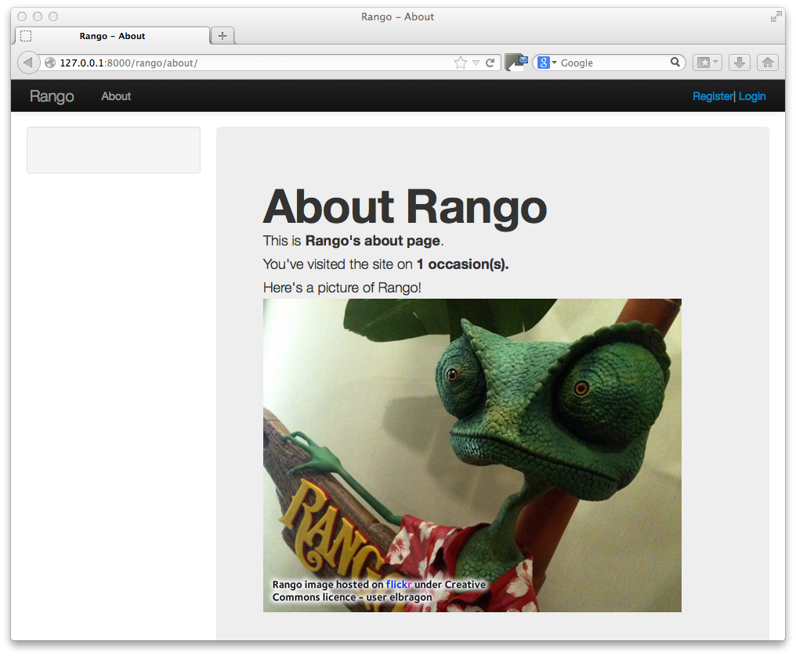
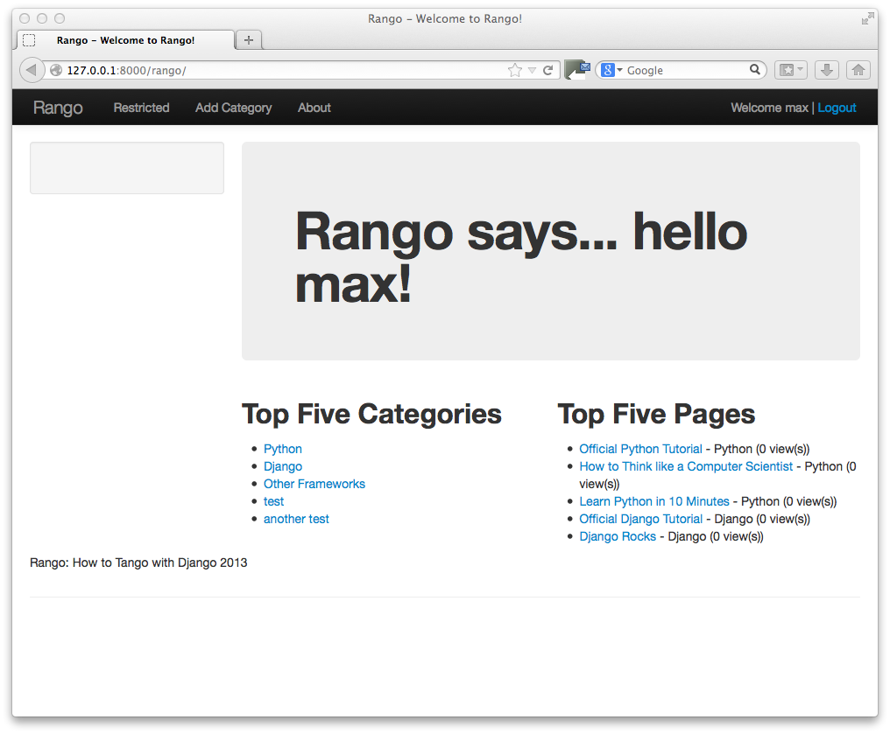

# 13 Bootstrap和Rango

在本章,我们将使用Bootstrap3.2套件来装饰我们的Rango.我们不需要了解Bootstrap工作的细节,但是我们假设你了解一些CSS.如果没有的话,去查看以下CSS章节或者一些Bootstrap教程了解一下基础知识.现在,你需要通过这一章把所有零碎的知识点连接起来.

开始我们先看一下Bootstrap 3.2.0 website - 它提供了实例代码和不同的组件,并且提供怎么加入样式标签的方法.在Bootstrap网站它们提供了许多example layouts可以给我们使用.

为了修改Rango样式我们需要定义dashboard style来满足我们的要求,例如在顶部的菜单栏,侧边栏(用来展示目录)和一个主内容区域.在使用Bootstrap的HTML之前我们还需要做一些工作.下面使我们需要做的:

* 把所有的`../../`改成`http://getbootstrap.com`
* 修改`dashboard.css`为绝对路径`http://getbootstrap.com/examples/dashboard/dashboard.css`
* 起初顶部导航栏的搜索表单
* 把所有没有必要的内容删除并用``替换.
* 设置标题元素为`<title>Rango - How to Tango with Django!</title>`
* 把项目的名字改为`Rango`
* 为顶部导航的主页,登录,注册添加链接.
* 添加侧边块,例如``

## 13.1 新的基础模板

```
<!DOCTYPE html>
<html lang="en">
  <head>
    <meta charset="utf-8">
    <meta http-equiv="X-UA-Compatible" content="IE=edge">
    <meta name="viewport" content="width=device-width, initial-scale=1">
    <meta name="description" content="">
    <meta name="author" content="">
    <link rel="icon" href="http://getbootstrap.com/favicon.ico">

    <title>Rango - How to Tango with Django!</title>

    <link href="http://getbootstrap.com/dist/css/bootstrap.min.css" rel="stylesheet">
    <link href="http://getbootstrap.com/examples/dashboard/dashboard.css" rel="stylesheet">

    <!--[if lt IE 9]>
      <script src="https://oss.maxcdn.com/html5shiv/3.7.2/html5shiv.min.js"></script>
      <script src="https://oss.maxcdn.com/respond/1.4.2/respond.min.js"></script>
    <![endif]-->
  </head>

  <body>

    <div class="navbar navbar-inverse navbar-fixed-top" role="navigation">
      <div class="container-fluid">
        <div class="navbar-header">
          <button type="button" class="navbar-toggle collapsed" data-toggle="collapse" data-target=".navbar-collapse">
            <span class="sr-only">Toggle navigation</span>
            <span class="icon-bar"></span>
            <span class="icon-bar"></span>
            <span class="icon-bar"></span>
          </button>
          <a class="navbar-brand" href="/rango/">Rango</a>
        </div>
        <div class="navbar-collapse collapse">
          <ul class="nav navbar-nav navbar-right">
                <li><a href="">Home</a></li>
                    
                        <li><a href="">Restricted Page</a></li>
                        <li><a href="?next=/rango/">Logout</a></li>
                        <li><a href="">Add a New Category</a></li>
                    
                        <li><a href="">Register Here</a></li>
                        <li><a href="">Login</a></li>
                    
                                <li><a href="">About</a></li>

              </ul>
        </div>
      </div>
    </div>

    <div class="container-fluid">
      <div class="row">
        <div class="col-sm-3 col-md-2 sidebar">
                

        </div>
        <div class="col-sm-9 col-sm-offset-3 col-md-10 col-md-offset-2 main">
           <div>
                
                </div>
        </div>
      </div>
    </div>

    <!-- Bootstrap core JavaScript
    ================================================== -->
    <!-- Placed at the end of the document so the pages load faster -->
    <script src="https://ajax.googleapis.com/ajax/libs/jquery/1.11.1/jquery.min.js"></script>
    <script src="http://getbootstrap.com/dist/js/bootstrap.min.js"></script>
    <!-- IE10 viewport hack for Surface/desktop Windows 8 bug -->
    <script src="http://getbootstrap.com/assets/js/ie10-viewport-bug-workaround.js"></script>
  </body>
</html>
```

如果仔细看dashboard的html源代码,会发现许多结构都是通过`<div>`标签创建的.页面被分为两部分 - 顶部导航栏和主面板,都被`<div class="container-fluid">`包含.在导航栏区域,我们加入我们网站的链接.在主面板区域有两列专栏,一个是`side_block`,另一个是`body_block`.

## 13.2 快速更改样式

使用上面的html代码更新你的`base.html`(假设你已经完成了12章的内容,使用了django-registration-redux 包,如果没有你需要更新这些url模板标签).重新加载你的应用.你需要联网才能下载css,js和其他相关文件.你注意到了你的应用看起来变化非常大.试着浏览其他页面看一看.因为它们都继承自基础模板,它们看起来都非常好看.虽然不完美但是非常好.

>注意:你应当下载所有关联的文件并存储到静态文件夹.如果这么做以后,在基础模板修改静态文件的引用.

现在我们已经设置好`base.html`,我们可以快速的使用Bootstrap组建来定制我们的页面.

让我们修改`about.html`模板,在页面里放置一个页面头(http://getbootstrap.com/components/#page-header) .在例子中,我们需要加入`<div>`并且使用`class="page-header"`属性:

```




About


    <div class="page-header">
                <h1>About</h1>
            </div>
            <div>
            <p></strong>.</p>

             <!-- New line -->
            </div>

```



注意到我们的侧边栏是空的,在下一章我们会排列导航栏的链接.但是首先我们需要处理一下首页.

### 13.2.1 首页

因为我们只封装了标题和页面,例如`<div class="page-header">`,我们还没有真正利用Bootstrap给我们提供的样式.所以我们采用列流页面并使用它们容纳顶级目录和顶级页面.因为原来的页面有4个列,我们使用两个并把它们的尺寸调大.修改`index.html`模板:

```




Index

        

    <div class="page-header">

                <h1>Rango says... hello {{ user.username }}!</h1>
            
                <h1>Rango says... hello world!</h1>
            
</div>

         <div class="row placeholders">
            <div class="col-xs-12 col-sm-6 placeholder">
               <h4>Categories</h4>

              
                    <ul>
                        
                         <li><a href="">{{ category.name }}</a></li>
                        
                    </ul>
                
                    <strong>There are no categories present.</strong>
                

            </div>
            <div class="col-xs-12 col-sm-6 placeholder">
              <h4>Pages</h4>

                
                    <ul>
                        
                         <li><a href="{{page.url}}">{{ page.title }}</a></li>
                        
                    </ul>
                
                    <strong>There are no categories present.</strong>
                
            </div>

          </div>


       <p> visits: {{ visits }}</p>
        
```

页面将会变得更漂亮了.但是列表的样式比较恶心.让我们使用Bootstrap的列表组样式 http://getbootstrap.com/components/#list-group .修改`<ul>`元素为`<ul class="list-group">`,修改`<li>`为`<li class="list-group-item">`然后使用panel样式修改heddings

```
    <div class="panel panel-primary">
    <div class="panel-heading">
            <h3 class="panel-title">Categories</h3>
    </div>
</div>


    <div class="panel panel-primary">
            <div class="panel-heading">
                    <h3 class="panel-title">Pages</h3>
            </div>
    </div>
```



## 13.3 登录页面

让我们将注意力转移到登录页面.在Bootstrap网站我们已经看到漂亮的登录表单,查看 http://getbootstrap.com/examples/signin/ .如果查看源代码,你会发现我们需要在基础登录表单上加入许多类.修改`login.html`模板如下:

```


<link href="http://getbootstrap.com/examples/signin/signin.css" rel="stylesheet">

<form class="form-signin" role="form" method="post" action=".">


<h2 class="form-signin-heading">Please sign in</h2>
<input class="form-control" placeholder="Username" id="id_username" maxlength="254" name="username" type="text" required autofocus=""/>
<input type="password" class="form-control" placeholder="Password" id="id_password" name="password" type="password" required />

        <button class="btn btn-lg btn-primary btn-block" type="submit" value="Submit" />Sign in</button>
        </form>


```

>这里有很多错误暂时不翻译?~

