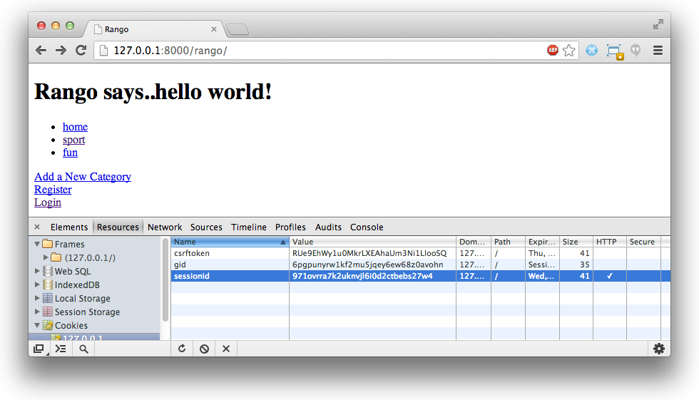
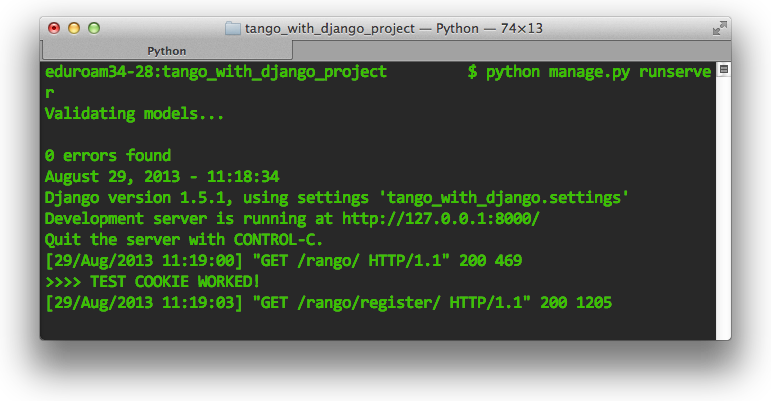

# 11 Cokkies和Sessions

在本章中我们将要介绍sessions和cookies,它们两个在现代wen应用中有着至关重要的作用.在上一章,Django框架使用sessions和cookies来处理用户登录和注销功能(都在背后运行).这里我们将要探索cookies的其他用途.

## 11.1 Cookies,无处不在的Cookies!

如果你已经熟知cookies的概念和它背后的运行机制,那么请直接跳转到11.2,如果没有让我们继续.

当我们请求访问一个网站时,服务器会返回请求页面的内容.另外还有一个或者多个cookies被传送给客户端,它们将会保存在浏览器的cache里.当一个用户在同一个网站服务器请求新的页面时,所有的关于这个页面的cookies也会发送到请求里.服务器会解析请求里的cookies字段并且生成一个特定的响应.

>这里我就不翻译了~~都是一些科普了

## 11.2 Sessions和无状态协议

所有的浏览器和服务器之间的交互都会通过HTTP协议.通过第8章简单的接触我们知道HTTP是无状态协议.这就意味着每次客户端请求(HTTP`GET`)或者发送(HTTP`POST`)资源给服务器都必须新建立一个连接(一个TCP连接).

因为客户端和服务器没有持续的连接,两端的软件不能仅仅通过单独的连接保持会话状态.例如,客户端每次都需要告诉服务器谁在这个主机上登录了这个web应用.这就是用户和服务器之间的会话,这也是session的基本 - a semi-permanent exchange of information.作为一个无状态协议,HTTP需要保持会话状态非常的困难 - 但是很走运我们可以使用几种技术来绕过这个问题.

最常用的一种保持状态的方法就是使用session ID,和cookies一样存储在客户端电脑.session ID可以认为是一种令牌(一大串字符串),它能够唯一标识特定web应用里的会话.和cookies存储许多不同种类的数据不一样(像用户名,名字,密码),它只存储session ID,并且映射到web服务器的一个数据结构.在这个数据结构里,你可以存储任何你需要的信息.这对于用户来说是更安全的存储方法.用这种方法,这些数据不会被一个不安全的客户端和连接所监听.

如果你的浏览器支持cookies,当你访问所有的网站时都会创建一个新的会话.你可以自己查看下,如图所示.在Google Chrome的开发者工具中,你可以查看到web服务器发送给你的cookies.在下图中,你可以观察到选中的`sessionid`cookie.这个cookie包含一系列的字母和数字,它可以使Django唯一标识一个会话.到现在,所有的session细节都表述完了 - 但是服务器端还没讲.



session ID也可以不存储在cookies中.传统的PHP应用会把它们做成一个请求字符串或是URL的一部分来请求资源.如果你偶然间访问像`http://www.site.com/index.php?sessid=omgPhPwtfIsThisIdDoingHere332i942394`这样的URL,很可能是服务器唯一识别你的标识.很有趣吧!

>注意:仔细看上图,注意到`csrftoken`令牌了吗?这个cookie帮助我们避免跨站请求.

## 11.3 在Django里设置Sessions

尽管我们已经设置好并且正确工作,但是如果学会Django的模块提供哪些工作就会更好了.关于sessions方面Django提供了middleware来提供session功能.

为了检查一切都设置妥当,打开Django项目里的`settings.py`文件.找到`MIDDLEWARE_CLASSES`元组.你可以在元组中看到`django.contrib.sessions.middleware.SessionMiddleware`模块 - 如果没有看到现在就加进去.正式这个`SessionMiddleware`中间件能够创建唯一的`sessionid`cookies.

`SessionMiddleware`可以灵活的使用不同的方法来存储session信息.你可以采取很多方法储存 - 存在文件,数据库甚至在cache中.最直接的方法是使用`django.contrib.sessions`应用把session信息存储到Django模型/数据库中(详细的说是`django.contrib.sessions.models.Session`模型).使用这种方法,你必须首先确保在Django项目的`settings.py`文件里`django.contrib.sessions`保存在`INSTALLED_APPS`元组里.如果你现在要添加应用,你需要使用迁移命令来更新数据库.

>注意:如果你希望使用轻量快捷的方式,你可以把session信息存储在cache中.可以查看 official Django documentation for advice on cached sessions.

## 11.4 基于cookie的session

我们现在测试我们的浏览器是否支持cookies.现代浏览器都支持cookies,你可以查看你浏览器的cookies信息.如果你的浏览器安全等级设定的非常高,一些特定的cookies会被阻塞.查看浏览器文档获取更多信息,设定使用cookies.

### 11.4.1 测试Cookie功能

为了测试cookies,你可以使用Django的`request`对象提供的便捷方法.其中`set_test_cookie()`,` test_cookie_worked()`和`delete_test_cookie()`方法对我们比较有用.在一个视图里,你需要设置一个cookie.在另一个视图你需要检查cookie是否存在.两个不同的视图都要请求cookies,是因为你要查看是否客户端接收了来自服务器的cookie.

我们将会使用前面创建的两个视图,`index()`和`register()`.如果你实现了用户验证功能,你需要确保你已经进行了注销.我们不会在网页上展示而是在终端里输出Django服务器验证cookies是否正常工作.当我们成功确认cookies确实正常工作,我们会移除代码恢复原状.

在Rango的`views.py`文件,找到`index()`视图.在里面添加下面这一行.为了确保这行能够执行,把它放在视图的第一行,不要包含在条件语段里.

```
request.session.set_test_cookie()
```

在`register()`视图顶部加入下面3行代码 - 同样是为了保证它们能被执行.

```
if request.session.test_cookie_worked():
    print ">>>> TEST COOKIE WORKED!"
    request.session.delete_test_cookie()
```

更改完以后运行Django服务并打开Rango首页,`http://127.0.0.1:8000/rango/`.页面加载完后,前往注册页面.当注册页面加载后,你将会和下图一样在终端里看到`>>>> TEST COOKIE WORKED!`.



如果没有看到上面的信息,请检查一下你的浏览器安全设置,有可能会阻止浏览器接受cookie.

>注意:你可以删除增加的代码 - 我们只是拿它用来验证以下cookies

## 11.5 客户端Cookies:一个网站技术的例子

现在我们已经知道cookies是如何工作的,让我们实现一个简单的网站访问计数.首先我们需要创建两个cookies:一个用来追踪用户访问Rango网站次数,另一个用来追踪上一次登录的时间.保持追踪用户上一次的访问时间和日期将允许我们每天只能增长一次访问次数.

假设用户访问的Rango页面一般为首页.打开`rango/view.py`并修改`index()`视图如下.

```
def index(request):

    category_list = Category.objects.all()
    page_list = Page.objects.order_by('-views')[:5]
    context_dict = {'categories': category_list, 'pages': page_list}

    # Get the number of visits to the site.
    # We use the COOKIES.get() function to obtain the visits cookie.
    # If the cookie exists, the value returned is casted to an integer.
    # If the cookie doesn't exist, we default to zero and cast that.
    visits = int(request.COOKIES.get('visits', '1'))

    reset_last_visit_time = False
    response = render(request, 'rango/index.html', context_dict)
    # Does the cookie last_visit exist?
    if 'last_visit' in request.COOKIES:
        # Yes it does! Get the cookie's value.
        last_visit = request.COOKIES['last_visit']
        # Cast the value to a Python date/time object.
        last_visit_time = datetime.strptime(last_visit[:-7], "%Y-%m-%d %H:%M:%S")

        # If it's been more than a day since the last visit...
        if (datetime.now() - last_visit_time).days > 0:
            visits = visits + 1
            # ...and flag that the cookie last visit needs to be updated
            reset_last_visit_time = True
    else:
        # Cookie last_visit doesn't exist, so flag that it should be set.
        reset_last_visit_time = True

        context_dict['visits'] = visits

        #Obtain our Response object early so we can add cookie information.
        response = render(request, 'rango/index.html', context_dict)

    if reset_last_visit_time:
        response.set_cookie('last_visit', datetime.now())
        response.set_cookie('visits', visits)

    # Return response back to the user, updating any cookies that need changed.
    return response
```

读下来这段代码你将会看到大部分的代码都是在处理当前日期和时间.所以在这里你需要在`views.py`文件的头部加入Python的`datetime`模块.

```
from datatime import datetime
```

确保引进了`datetime`模块里的`datetime`对象.

在代码中我们检查`last_visit`是否存在.如果存在我们就使用`request.COOKIES['cookie_name']`语法来获取它的值,这里的`request`就是`request`对象的名字,`cookie_name`就是你希望跟踪的cookie名.**注意返回的所有的cookie值都是字符串**;不要认为cookie保存的是数字就会返回整型.你需要自己把它们转化成正确的形式.如果这个cookie不存在,你需要使用`response`对象的`set_cookie()`方法来创建cookie.这个方法包含两个值,cookie名(字符串)和cookie值.不管你输入的是什么形式 - 它都会自动转化成字符串.


如果你现在打开Rango主页,检查你浏览器中的开发者工具,你将会看到`visits`和`last_visit`两个cookie.如上图所示.

>注意:你或许注意到了刷新浏览器并不能使`visits`增长.为什么?因为上面给出的示例代码只在用户上次访问距今是1天时才增加.当我们测试的时候这个值有点不合理 - 所以为什么我们不缩短以下这个时间呢?修改`index()`视图,找到下面这一行.
```
if (datetime.now() - last_visit_time).days > 0:
```
我们可以把它们更改为秒数级别的比较.在下面的例子,我们检查是否在5秒之外有登录.
```
if (datetime.now() - last_visit_time).seconds > 5:
```
这就意味着你只需要等待5秒的时间就能看到`visits`cookie的增长,而不需要一整天.当你这么玩完以后,就可以把它改回来了.
在不同的时间里使用`-`操作符可以求出它们的差值是Python提供给我们的非常使用的功能.当时间相减,就会返回一个`timedelta`对象,就像上面代码它提供给我们`days`和`seconds`属性.你可以查看 official Python documentation来获取更多关于对象类型和其他属性的信息.

我们可以修改`index.html`在里面加入`<p> visits: {{ visits }}</p>`来现实访问次数.

## 11.6 Session数据

在前一个例子中我们使用了客户端的cookies.然而,另一种更安全的方法是把session信息存储在服务器端.我们可以使用存储在客户端的session ID cookie作为解锁数据的钥匙.

使用基于cookie的session你需要完成以下几步.

1. 确保`settings.py`文件的` MIDDLEWARE_CLASSES `包含`django.contrib.sessions.middleware.SessionMiddleware`.
2. 配置session后台.确定`django.contrib.sessions`在你`settings.py`文件的`INSTALLED_APPS`里.如果没有则添加并且运行数据库迁移命令`python manage.py migrate`.
3. 假设使用数据库作为后台,但是你也可以设置成其他(比如cache).参见 official Django Documentation on Sessions for other backend configurations.

现在我们可以调用`request.session.get()`方法访问服务器端的cookies,使用`request.session[]`存储它们.注意session ID cookie仍然用来标记客户端机器(严格的说是存在一个浏览器端的cookie),但是所有的数据都存储在服务器端.下面我们修改`index()`函数使用基于cookie的session:

```
def index(request):

    category_list = Category.objects.order_by('-likes')[:5]
    page_list = Page.objects.order_by('-views')[:5]

    context_dict = {'categories': category_list, 'pages': page_list}

    visits = request.session.get('visits')
    if not visits:
        visits = 1
    reset_last_visit_time = False

    last_visit = request.session.get('last_visit')
    if last_visit:
        last_visit_time = datetime.strptime(last_visit[:-7], "%Y-%m-%d %H:%M:%S")

        if (datetime.now() - last_visit_time).seconds > 0:
            # ...reassign the value of the cookie to +1 of what it was before...
            visits = visits + 1
            # ...and update the last visit cookie, too.
            reset_last_visit_time = True
    else:
        # Cookie last_visit doesn't exist, so create it to the current date/time.
        reset_last_visit_time = True

    if reset_last_visit_time:
        request.session['last_visit'] = str(datetime.now())
        request.session['visits'] = visits
    context_dict['visits'] = visits


    response = render(request,'rango/index.html', context_dict)

    return response
```

>警告:强烈建议你在启用基于session数据之前删除所有客户端的cookies.你可以在你的浏览器里对它们进行删除,或者是直接清空浏览器的cache - 确保cookies在这个过程中删除.

>注意:使用session存储数据的另一个优点是它可以把数据从字符串转化成响应的类型.然而只有像`int`,`float`,`long`,`complex`和`boolean`这样的内置类型才有用.如果你希望存储字典或是其他复杂的类型就不可以啦.在这种情况下你需要 pickling your objects.

## 11.7 Browser-Length and Persistent Sessions

当你使用cookies时你可以使用Django的session框架来设置browser-lenght sessions或者persistent sessions.这两个名字的解释如下:

* browser-length sessions是当浏览器关闭时截至.
* persistent sessions可以随你的选择而结束.它可以是一个小时甚至是一个月.

默认的browser-length sessions是被关闭的.你可以通过设置Django的`settings.py`来开启它(增加`SESSION_EXPIRE_AT_BROWSER_CLOSE`并设置为`true`).

persistent session默认是开启的,可以设置`SESSION_EXPIRE_AT_BROWSER_CLOSE`为`False`进行开启.persistent sessions有一个额外的设置`SESSION_COOKIE_AGE`,它可以允许你设置cookie的存活时间.这个值是一个整型,代表着cookie能存活的秒数.例如修改为`1209600`意味着网页的cookies将会在两周后过期.

查看 official Django documentation on cookies 获取更多可用的设置.也可以查看 Eli Bendersky’s blog这篇讲述Django和cookie的文章.

## 11.8 清除Sessions数据库

Session cookies是不断累积的.所以如果你是使用数据库作为后台你需要定期的清除存储的cookies.可以用`python manage.py clearsessions`命令来实现.Django文档里建议每天运行一次.参见https://docs.djangoproject.com/en/1.7/topics/http/sessions/#clearing-the-session-store

## 11.9 基本的注意事项和流程

在Django应用中使用cookies,有一些事情你需要注意:

* 首先,考虑你的web应用需要什么类型的cookies.你保存的信息需要持续存储还是在会话结束后就截至?
* 对你使用cookies储存的信息要格外小心.存储在cookies里的信息同样会呈现在用户的电脑上.这样做的风险非常的大:你不会知道用户的电脑是多么的危险.如果保存一些敏感的信息还是存在服务器端吧.
* 另一个致命的是用户可以设置他的浏览器级别非常的高,这将会阻止你的cookies.一旦你的cookies被阻拦,你的网站功能就会异常.你必须想到这一点 - 你无法空值用户浏览器.

如果你的情况适合客户端cookies,你可以按照如下步骤进行:

1. 首先检查你希望的cooki是否存在.可以用检查`request`参数实现.`request.COOKIES.has_key('<cookie_name>')`函数会返回一个布尔值来告诉我们是否有一个叫`<cookie_name>`的cookie存在.
2. 如果这个cookie存在,你可以通过`request.COOKIES[]`来获取.`COOKIES`属性是一个字典,你可以把你希望获取的cookie名写入方括号中.记住所有的cookies都返回为字符串.因此你必须把它们转化成正确的类型.
3. 如果cookie不存在或者你希望更新cookie.你可以使用`response.set_cookie('<cookie_name>', value)`函数来实现,这里的两个参数分别是cookie的名字和他们的值.

如果你需要更安全的cookies,那么就需要使用基于cookies的session:

1. 确保`settings.py`中的` MIDDLEWARE_CLASSES`包含`django.contrib.sessions.middleware.SessionMiddleware`.
2. 设置你的session后台`SESSION_ENGINE`.查看 official Django Documentation on Sessions 获取不同后台的不同设置.
3. 通过`requests.sessions.get()`来获取存在的cookie.
4. 通过`requests.session['<cookie_name>']`更改或设置cookie.

## 11.10 练习

现在你已经完成了这章,下面来做一些简单的练习.

* 检查服务器端cookies.清除浏览器cache和cookies,然后确定`last_visit`和`visits`都被删除.注意你将仍然恩可以看到`sessionid`cookie.Django使用这个cookie可以去查询数据库,这个数据库储存所有的关于服务端的session.
* 更改About页面视图和模板,现实用户访问网站的次数.

### 11.10.1 提示

为了帮助你完成上面的练习,下面的提示可能帮助你.

你必须把cookie的值传递给模板的上下文,使它传递给页面,代码如下:

```
# If the visits session varible exists, take it and use it.
# If it doesn't, we haven't visited the site so set the count to zero.
if request.session.get('visits'):
    count = request.session.get('visits')
else:
    count = 0

# remember to include the visit data
return render(request, 'rango/about.html', {'visits': count})
```

