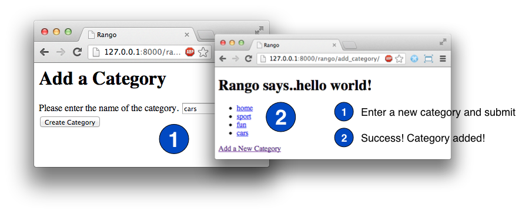

# 8 有趣的表单

到目前为止我们仅仅是通过视图和模板来表现数据.在本章,我们将会学习如何通过web表单来获取数据.Django包含一些表单处理功能,它使在web上收集用户信息变得简单.通过Django’s documentation on forms我们知道表单处理功能包含以下:

1. 显示一个HTML表单自动生成的窗体部件(比如一个文本字段或者日期选择器).
2. 用一系列规则检查提交数据.
3. 验证错误的情况下将会重新显示表单.
4. 把提交的表单数据转化成相关的Python数据类型.

使用Django表单功能最大的好处就是它可以节省你的大量时间和HTML方面的麻烦.这部分我们将会注重如何通过表单让用户增加目录和页面.

## 8.1 基本流程

基本步骤包括创建表单和允许用户通过表单输入数据.

1. 在Django应用目录创建`forms.py`目录来存储和表单相关的类.
2. 为每个使用表单的模块创建`ModelForm`类.
3. 定制你的表单.
4. 创建或修改表单的视图 - 包括展示表单,存储表单数据,当用户输入错误数据(或者根本没有输入)时显示错误标志.
5. 创建或修改你表单的模板.
6. 为新视图增加`urlpattern`映射(如果你创建了一个新的).

这个流程将会比先前的都复杂些,我们创建的视图也会非常复杂.但是孰能生巧,如果多练几次就非常好掌握了.

## 8.2 页面和目录表单

首先,我们需要在`rango`应用目录里黄建叫做`forms.py`文件.尽管这步我们并不需要,我们可以把表单放在`models.py`里,但是这将会使我们的代码简单易懂.

### 8.2.1 创建`ModelForm`类

在rango的`forms.py`模块里我们将会创建一些继承自`ModelForm`的类.实际上,ModelForm是一个帮助函数,它允许你在一个已经存在的模型里创建Django表单.因为我们定义了两个模型(`Category`和`Page`),我们将会分别为它们创建`ModelForms`.

在`rango/forms.py`添加下面代码:

```
from django import forms
from rango.models import Page, Category

class CategoryForm(forms.ModelForm):
    name = forms.CharField(max_length=128, help_text="Please enter the category name.")
    views = forms.IntegerField(widget=forms.HiddenInput(), initial=0)
    likes = forms.IntegerField(widget=forms.HiddenInput(), initial=0)
    slug = forms.CharField(widget=forms.HiddenInput(), required=False)

    # An inline class to provide additional information on the form.
    class Meta:
        # Provide an association between the ModelForm and a model
        model = Category
        fields = ('name',)


class PageForm(forms.ModelForm):
    title = forms.CharField(max_length=128, help_text="Please enter the title of the page.")
    url = forms.URLField(max_length=200, help_text="Please enter the URL of the page.")
    views = forms.IntegerField(widget=forms.HiddenInput(), initial=0)

    class Meta:
        # Provide an association between the ModelForm and a model
        model = Page

        # What fields do we want to include in our form?
        # This way we don't need every field in the model present.
        # Some fields may allow NULL values, so we may not want to include them...
        # Here, we are hiding the foreign key.
        # we can either exclude the category field from the form,
        exclude = ('category',)
        #or specify the fields to include (i.e. not include the category field)
        #fields = ('title', 'url', 'views')
```

TODO(leifos):值得注意的是Django1.7+需要通过`fields`指定包含的字段,或者通过`exclude`指定排除的字段.

Django为我们提供了许多定制表单的方法.在上面的例子中,我们指定了我们想要展示字段的窗口部件.例如在我们的`PageForm`类中,我们为`title`字段定义`forms.CharField`,为`url`字段定义`forms.URLField`.两个字段都为用户提供文本输入.注意字段里包含`max_length`参数 - 它定义字段最大长度.可以返回第6章或者rango的`models.py`文件查看.

可以看到在每个表单都包含浏览和喜欢的`IntegerField`字段.我们可以在参数里设置`widget=forms.Hiddeninput()`来隐藏窗口组件,设置`initial=0`来设置默认值为0.这是不用用户去自己设置字段为0的一种方法.然而可以在`PageForm`看到,尽管我们隐藏了字段,但是我们还是得在表单里包含字段.如果`fields`排除了`views`,那么表单将不包含字段(尽管已经定义了)而且将不会返回给模型0值.由于模型建立的不同有可能会引起一个错误.如果在模型里我们把这些字段定义为`default=0`那么我们可以自动的返回默认值 - 从而避免`not null`错误.在这种情况下就不需要隐藏字段了.在表单里我们也包含了`slug`字段并设置为`widget=forms.HiddenInput()`值,这里我们并没给他设置初始值或者默认值,而是设置为不需要(`required=False`).这是因为我们的模型将会负责填充字段.实际上,当你定义模型和表单时一定要注意表单一定要包含和传递所有的数据.

除了`CharField`和`IntegerField`组件还有许多.例如,Django提供了`EmailField`(e-mail地址入口),`ChoiceField`(输入按钮)和`DateField`(日期/时间入口).有许多其他不同种类字段可以使用,他们可以为你检查执行错误(例如是否提供了一个有效的整数?).强烈建议你看一下official Django documentation on widgets来定制自己的组件.

或许继承`ModelForm`最大的作用就是需要定义我们要给哪个模型提供表单.我们通过`Meta`类来实现.在`Meta`类设置`model`属性为我们需要使用的模型.例如`CategoryForm`类引用`Category`模型.这对Django创建我们想要的模型表单至关重要.它还可以帮助我们在存储和展示表单数据时获取错误.

我们也可以用`Meat`类来定义我们希望包括的表单字段.用`fields`元组来定义所需包含的字段.

>注意:强烈建议查看 official Django documentation on forms来获取更多.

### 8.2.2 创建和增加目录视图

创建`CategoryForm`类以后,我们需要创建一个新的视图来展示表单并传递数据.在`rango/views.py`中增加如下代码.

```
from rango.forms import CategoryForm

def add_category(request):
    # A HTTP POST?
    if request.method == 'POST':
        form = CategoryForm(request.POST)

        # Have we been provided with a valid form?
        if form.is_valid():
            # Save the new category to the database.
            form.save(commit=True)

            # Now call the index() view.
            # The user will be shown the homepage.
            return index(request)
        else:
            # The supplied form contained errors - just print them to the terminal.
            print form.errors
    else:
        # If the request was not a POST, display the form to enter details.
        form = CategoryForm()

    # Bad form (or form details), no form supplied...
    # Render the form with error messages (if any).
    return render(request, 'rango/add_category.html', {'form': form})
```

新的`add_category()`视图增加几个表单的关键功能.首先,检查HTTP请求方法是`GET`还是`POST`.我们根据不同的方法来进行处理 - 例如展示一个表单(如果是`GET`)或者处理表单数据(如果是`POST`) -所有表单都是相同URL.`add_category()`视图处理以下三种不同情况:

* 为添加目录提供一个新的空白表单;
* 保存用户提交的数据给模型,并转向到Rango主页;
* 如果发生错误,在表单里展示错误信息.

>注意:`GET`和`POST`是什么意思?他们是HTTP请求的两个不同类型.
* 一个HTTP`GET`用来请求指定的资源.换句话说,不管他是网页,图片还是文件,我们都可以用HTTP`GET`来获取.
* 相反的HTTP`POST`用来提交客户端网页浏览器的数据.这种请求类型用来提交HTML表单.
* 一个HTTP`POST`也可能用来在服务器上创建新的资源(例如新的数据库条目),以后可以通过HTTP`GET`请求.

Django表单处理数据是用过用户浏览器的HTTP`POST`请求实现.它不仅可以存储表单数据,而且还能对每个表单字段自动生成错误信息.这就意味着Django将不会存储表单的错误信息以保护数据库的数据完整性.例如如果目录名为空的话将会返回不能为空的错误.

注意到`render()`中将会调用`add_category.html`模板,这个模板包含表单和页面.

### 8.2.3 创建增加目录模板

让我们创建`templates/rango/add_category.html`文件.

```
<!DOCTYPE html>
<html>
    <head>
        <title>Rango</title>
    </head>

    <body>
        <h1>Add a Category</h1>

        <form id="category_form" method="post" action="/rango/add_category/">

            
            
                {{ hidden }}
            

            
                {{ field.errors }}
                {{ field.help_text }}
                {{ field }}
            

            <input type="submit" name="submit" value="Create Category" />
        </form>
    </body>

</html>
```

好吧,这些代码是干什么的?可以看到在`<body>`标签中我们设置了一个`<form>`元素.再来看看`<form>`中的元素,所有表单中的数据将会用`POST`请求发送给`/rango/add_category/`(`method`属性大小写不敏感,所以可以写成`POST`或是`post` - 两者功能一样).在表单里我们有两个循环 - 一个控制表单隐藏字段,另一个则是可见字段 - 可见字段的设置是在`ModelForm`的`Meta`类中设置`fields`属性来实现的.这些循环帮助我们生成HTML标记.对于表单的可见字段,我们也设置一个特殊区域来展示错误信息,同时设置帮助文本告诉用户那需要输入什么.

>注意:使用隐藏和可见表单字段是因为HTTP是无状态协议.你不可以在两个不同的HTTP请求之间保持状态,因为实现起来相当复杂.为了摆脱这个限制,创建隐藏的HTML表单字段可以使web应用传递给用户HTML表单重要的数据,只有用户提交的时候才会返回数据.

可能你也注意到了代码``,这是跨站请求伪造令牌,有助于保护我们提交表单的HTTP`POST`方法的安全.Django框架要求使用CSRFtoken.如果忘记在你的表单里包含CSRF令牌,有可能会在提交表单时遇到错误.查看 official Django documentation on CSRF tokens 以获取更多信息.

### 8.2.4 映射增加目录视图

现在我们需要映射`add_category()`视图.在模板里我们使用`/rango/add_category/`URL来提交.所以我们需要修改`rango/urls.py`的`urlpattterns`.

```
urlpatterns = patterns('',
    url(r'^$', views.index, name='index'),
    url(r'^about/$', views.about, name='about'),
    url(r'^add_category/$', views.add_category, name='add_category'), # NEW MAPPING!
    url(r'^category/(?P<category_name_slug>[\w\-]+)/$', views.category, name='category'),)
```

在这里顺序并不重要.更多内容需要查看official Django documentation on how Django process a request.我们增加的URL是`/rango/add_category/`.

### 8.2.5 修改主页内容

作为最后一步,让我们在首页里加入链接.修改`rango/index.html`文件,在`</body>`前添加如下代码.

```
<a href="/rango/add_category/">Add a New Category</a><br />
```

### 8.2.6 Demo

现在试一试!启动Django服务,进入`http://127.0.0.1:8000/rango/`.用新加的链接跳转到增加目录页面,然后增加页面.下图是增加目录和首页截图.



>注意:如果你增加许多目录,它们有可能不会出现在首页,这是因为我们紧紧展示5个目录.如果登录管理界面你就能看到所有输入的目录了.#TODO

### 8.2.7 清理表单

记得我们`Page`模型有一个`url`属性设置为`URLField`类型.在相应的HTML表单,Django希望任何文本输入的URL字段是一个完整的URL.然而,用户能发现输入像`http://www.url.com`这种形式有些繁琐 - 确实,用户 may not even know what forms a correct URL!

设想有时候用户输入并不是一定正确,我们可以重写`ModelForm`模块里`clean()`方法.这个方法会在表单数据存储到模型实例之前被调用,所以它可以让我们验证甚至修改用户输入的数据.在我们上面的例子中,我们可以检查`url`字段的值是否以`http://`开头 - 如果不是我们可以在用户前面添加上`http://`.

```
class PageForm(forms.ModelForm):

    ...

    def clean(self):
        cleaned_data = self.cleaned_data
        url = cleaned_data.get('url')

        # If url is not empty and doesn't start with 'http://', prepend 'http://'.
        if url and not url.startswith('http://'):
            url = 'http://' + url
            cleaned_data['url'] = url

        return cleaned_data
```

在`clean()`方法里.

1. 表单数据的字典从`ModelForm`的`cleaned_data`属性获取.
2. 你希望检查的表单字段可以在`cleaned_data`字典中获取.使用`.get()`字典方法获取表单值.如果用户没有表单字段,那么`cleaned_data`字典就没有这项.在这种情况下`.get()`会返回`None`而不是引发异常.浙江会是你的代码更加简洁!
3. 处理你希望处理的表单字段.如果输入了一个值,检查这个值.如果不是你希望的值,你可以在存储到`cleaned_data`字典之前增加一些逻辑来修改这个值.
4. 必须每次都是以返回`cleaned_data`字典来结束`clean()`方法.如果没有将会得到错误提示.

这个小例子说明如何在表单数据存储之前进行修改.这是非常方便的,尤其是有一些字段需要设定默认值时 - 或者表单中的数据发生了丢失.

>注意:重写方法是Django框架提供给我们增加应用额外功能的一种优雅的方法.就像`ModelForm`模块中`clean()`方法一样,Django提供了许多安全的方法可以供你重写.检查 the Official Django Documentation on Models以获取更多信息.

## 8.3 练习

练习下面题目巩固所学.

* 当在增加目录表单输入空值将会发生什么?
* 增加一个已存在的目录会发生什么?
* 访问不存在的目录会发生什么?
* 当用户访问一个不存在的目录时如何优雅的处理?
* 查看 part four of the official Django Tutorial

### 8.3.1 创建增加页面视图,模板和URL映射

下一步是要求用户对于给出的目录增加页面.为了时间这个,我们需要重复上面相同的流程 - 创建一个新的试图(`add_page()`),一个新的模板(`rango/add_page.html`),URL映射和在目录页面增加一个链接.这里给出一点提示.

```
from rango.forms import PageForm

def add_page(request, category_name_slug):

    try:
        cat = Category.objects.get(slug=category_name_slug)
    except Category.DoesNotExist:
                cat = None

    if request.method == 'POST':
        form = PageForm(request.POST)
        if form.is_valid():
            if cat:
                page = form.save(commit=False)
                page.category = cat
                page.views = 0
                page.save()
                # probably better to use a redirect here.
                return category(request, category_name_slug)
        else:
            print form.errors
    else:
        form = PageForm()

    context_dict = {'form':form, 'category': cat}

    return render(request, 'rango/add_page.html', context_dict)
```

### 8.3.2 提示

* 修改`category()`视图,把`category_name_slug`加入进视图的`context_dict`字典.
* 修改`category.html`添加`/rango/category/<category_name_url>/add_page/`链接.
* 确保只有请求的目录存在时才会出现链接 -页面存在或不存在皆可.例如,在模板用` ....  A category by this name does not exist `.
* 在`rangp/urls.py`修改URL映射.
