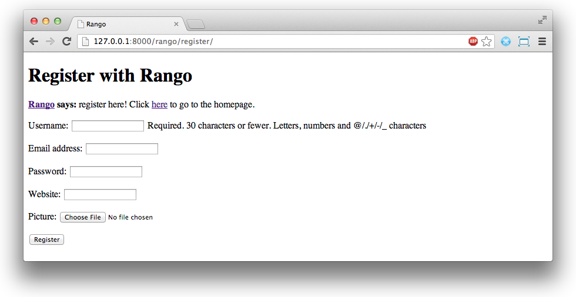
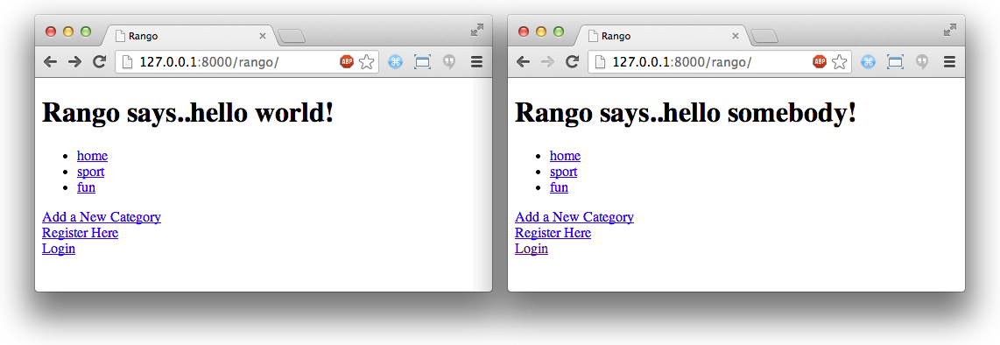

# 9 用户验证

教程的下一部分将教会你Django的用户验证机制.我们将会使用Django标准包`django.contrib.auth`的`auth`应用.通过 Django’s official documentation on Authentication,应用包含下面几方面.

* 用户.
* 权限:一系列的二进制标志(例如 yes/no)决定用户可以做或不可以做什么.
* 群组:为不止一个用户提供权限的方法.
* 用户登录的表单和视图工具,还有限制内容.

在用户验证方面Django可以做很多.我们将从基础开始学习.这将非常有利于建立使用它们的信心和它们运行的理念.

## 9.1 设置验证

在你使用Django的验证之前,你需要确定在你的Rango项目的`settings.py`文件里已经设置了相关内容.

在`settings.py`文件里找到`INSTALLED_APPS`元组,检查`django.contrib.auth`和`django.contrib.contenttypes`是否在元组里.

```
INSTALLED_APPS = (
    'django.contrib.admin',
    'django.contrib.auth',
    'django.contrib.contenttypes',
    'django.contrib.sessions',
    'django.contrib.messages',
    'django.contrib.staticfiles',
    'rango',
)
```

`django.contrib.auth `为Django提供访问认证系统,`django.contrib.contenttypes`可以通过认证的应用程序来跟踪安装的数据库模型.

>注意:如果你需要在`INSTALLED_APPS`元组里添加`auth`应用,你需要用命令`python manage.py migrate`来进行更新数据库.

密码默认将会用 PBKDF2 algorithm进行储存,它可以安全的保存你用户的数据.在 official Django documentation on how django stores passwords你可以了解到更多,文档还提供了使用不同的哈希算法来提高安全等级.

如果你希望控制使用哪种哈希算法,你需要在`settings.py`里加入`PASSWORD_HASHERS`元组:

```
PASSWORD_HASHERS = (
'django.contrib.auth.hashers.PBKDF2PasswordHasher',
'django.contrib.auth.hashers.PBKDF2SHA1PasswordHasher',
)
```

Django将会使用`PASSWORD_HASERS`里的第一个哈希算法(例如 `settings.PASSWORD_HASHERS[0]`).如果想要获取更多的安全的哈希算法,可以用`pip install bcrypt`来安装Bcrypt(查看 https://pypi.python.org/pypi/bcrypt/ ),然后在`PASSWORD_HASHERS`设置如下:

```
PASSWORD_HASHERS = (
        'django.contrib.auth.hashers.BCryptSHA256PasswordHasher',
'django.contrib.auth.hashers.BCryptPasswordHasher',
'django.contrib.auth.hashers.PBKDF2PasswordHasher',
'django.contrib.auth.hashers.PBKDF2SHA1PasswordHasher',
)
```

然而在默认情况下你不需要修改`PASSWORD_HASHERS`,Django默认添加`django.contrib.auth.hashers.PBKDF2PasswordHasher`.

## 9.2 用户模型

Django认证系统最重要的部分就是`User`对象,它位于`django.contrib.auth.models.User`.一个`User`对象代表了和Django应用交互的用户. Django documentation on User objects 有详尽的描述.

`User`模型主要有5个属性.它们是:

* 账户的用户名;
* 账户密码;
* 用户邮箱地址;
* 用户名;
* 用户姓;

模型也有其他一些属性像`is_active`(决定账户是活动还是非活动状态).查看official Django documentation on the user model,这里有完整的`User`模型属性列表.

## 9.3 增加用户属性

如果你希望在`User`模型里加入其他属性,你需要创建一个和`User`模型相关的模型.对于我们的Rango应用,我们希望为我们的用户增加两个属性.我们希望包含:

* `URLField`,允许用户写明自己的网站;
* `ImageField`,允许用户在它们的档案里添加图片.

可以再Rango的`models.py`文件里增加模型.让我们加入`UserProfile`模型:

```
class UserProfile(models.Model):
    # This line is required. Links UserProfile to a User model instance.
    user = models.OneToOneField(User)

    # The additional attributes we wish to include.
    website = models.URLField(blank=True)
    picture = models.ImageField(upload_to='profile_images', blank=True)

    # Override the __unicode__() method to return out something meaningful!
    def __unicode__(self):
        return self.user.username
```

注意我们在`User`模型里使用一对一关系.因为我们使用了默认`User`模型,我们需要在`models.py`文件中导入.

```
from django.contrib.auth.models import User
```

在这里我们还可以直接继承`User`模型来增加这些字段.但是因为其他应用也可能需要存取`User`模型,所以这里不建议使用继承,而是使用一对一关系来代替.

对于Rango我们已经增加了两个字段来完善用户档案,还提供了一个`__unicode__()`方法返回实例名称.

对于`website`和`picture`两个字段,我们都设置了`blank=True`.它会使所有的字段都为空,意味着用户不必为每一个都设置字段值.

注意`ImageField`字段有一个`upload_to`属性.这个属性值连接着`MEDIA_ROOT`设置用来提供上传文档图片的路径.例如,`MEDIA_ROOT`设置为`<workspace>/tango_with_django_project/media/`,那么`upload_to=profile_imges`将会使图片保存在`<workspace>/tango_with_django_project/media/profile_images/`目录.

>警告:Django`ImageField`使用python图片库(PIL).返回到第3章,我们在安装Django时已经讲过如何安装PIL.如果还没有安装现在就可以安装了.如果你没有安装PIL,那么将会遇到`pil`模块不能找到的错误!

定义完`UserProfile`模型,我们需要修改Rango的`admin.py`文件使管理界面包含`UserPrifile`模型.在`admin.py`文件里添加如下.

```
from rango.models import UserProfile

admin.site.register(UserProfile)
```

>注意:我们在修改模型后需要更新数据库.在终端里运行`$ python manage.py makemigrations rango`来为`UserProfile`模型创建迁移脚本.然后运行`$ python manage.py migrate`.

## 9.4 创建用户注册视图和模板

用户认证已经处理完毕,我们现在需要让用户在网站上进行注册.我们将通过创建新视图和模板来达到这个目的.

>注意:这里有许多现成的用户注册包可以使用,它们大大的减少创建注册和表单的繁琐程度.然而使用这样的应用对于了解内部机制是非常好的.它将会使你加深对表单,扩展用户模型和上传媒体的理解.

为用户提供注册服务我们需要以下几步:

1. 创建`UserForm`和`UserProfileForm`.
2. 增加创建新用户视图.
3. 增加展示`UserForm`和`UserProfileForm`的模板.
4. 映射URL.
5. 在主页放置注册页链接

### 9.4.1 创建`UserForm`和`UserProfileForm`

在`rango/forms.py`中,我们需要创建两个继承自`forms.ModelForm`的类.一个是为`User`模型创建的,一个是为`UserProfile`创建的.这两个继承自`ModelForm`的类给我们提供展示HTML表单所需要的表单字段.

在`rango/forms.py`文件,让我们创建这两个类.

```
class UserForm(forms.ModelForm):
    password = forms.CharField(widget=forms.PasswordInput())

    class Meta:
        model = User
        fields = ('username', 'email', 'password')

class UserProfileForm(forms.ModelForm):
    class Meta:
        model = UserProfile
        fields = ('website', 'picture')
```

注意到在两个类中我们都加入了`Meta`类.在`Meta`类中所有定义都会被当做它的附加属性.每个`Meta`至少包含一个`model`字段,它可以和模型之间关联.例如在我们的`UserForm`类中就关联了`User`模型.在Django1.7中你可以用`fields`或者`exclude`来定义你需要展示的字段.

这里我们仅仅需要展示`User`模型的`username`,`email`和`password`字段,和`UserProfile`模型的`website`和`picture`字段.当用户注册的时候我们需要连接`UserPrifile`模型的`user`字段.

看到了吧`UserForm`包含一个定义`password`属性.当`User`模型实例默认包含`password`属性时,HTML表单元素将不会隐藏密码.如果用户输入密码,那么这个密码就会可见.所以我们修改`password`属性作为`CharField`实例并使用`PasswordInput()`组建,这时用户输入就会被隐藏.

最后,记得在`forms.py`模块顶部包含下面引用!

```
from django import forms
from django.contrib.auth.models import User
from rango.models import Category, Page, UserProfile
```

### 9.4.2 创建`register()`视图

下面我们处理表单和表单输入的数据.在Rango的`views.py`文件,加入下面视图函数:

```
from rango.forms import UserForm, UserProfileForm

def register(request):

    # A boolean value for telling the template whether the registration was successful.
    # Set to False initially. Code changes value to True when registration succeeds.
    registered = False

    # If it's a HTTP POST, we're interested in processing form data.
    if request.method == 'POST':
        # Attempt to grab information from the raw form information.
        # Note that we make use of both UserForm and UserProfileForm.
        user_form = UserForm(data=request.POST)
        profile_form = UserProfileForm(data=request.POST)

        # If the two forms are valid...
        if user_form.is_valid() and profile_form.is_valid():
            # Save the user's form data to the database.
            user = user_form.save()

            # Now we hash the password with the set_password method.
            # Once hashed, we can update the user object.
            user.set_password(user.password)
            user.save()

            # Now sort out the UserProfile instance.
            # Since we need to set the user attribute ourselves, we set commit=False.
            # This delays saving the model until we're ready to avoid integrity problems.
            profile = profile_form.save(commit=False)
            profile.user = user

            # Did the user provide a profile picture?
            # If so, we need to get it from the input form and put it in the UserProfile model.
            if 'picture' in request.FILES:
                profile.picture = request.FILES['picture']

            # Now we save the UserProfile model instance.
            profile.save()

            # Update our variable to tell the template registration was successful.
            registered = True

        # Invalid form or forms - mistakes or something else?
        # Print problems to the terminal.
        # They'll also be shown to the user.
        else:
            print user_form.errors, profile_form.errors

    # Not a HTTP POST, so we render our form using two ModelForm instances.
    # These forms will be blank, ready for user input.
    else:
        user_form = UserForm()
        profile_form = UserProfileForm()

    # Render the template depending on the context.
    return render(request,
            'rango/register.html',
            {'user_form': user_form, 'profile_form': profile_form, 'registered': registered} )
```

看起来是不是很难啊?可能一开始看起来比较复杂,但其实不然.和我们前面`add_category()`视图差不多,仅仅添加了两个不同的`ModelForm`实例 - 一个是`User`模型的,另一个是`UserProfile`模型的.如果用户上传图像我们还得需要处理它们.

我们还需要创建两个模型实例之间的连接.创建新的`User`模型实例后,我们需要用`profile.user = user`把它关联到`UserProfile`实例.我们在已经在9.4.1隐藏的`UserProfileForm`表单里填充了`user`属性.

### 9.4.3 创建注册模板

现在我们创建`rang/register.html`加入如下代码:

```
<!DOCTYPE html>
<html>
    <head>
        <title>Rango</title>
    </head>

    <body>
        <h1>Register with Rango</h1>

        
        Rango says: <strong>thank you for registering!</strong>
        <a href="/rango/">Return to the homepage.</a><br />
        
        Rango says: <strong>register here!</strong><br />

        <form id="user_form" method="post" action="/rango/register/"
                enctype="multipart/form-data">

            

            <!-- Display each form. The as_p method wraps each element in a paragraph
                 (<p>) element. This ensures each element appears on a new line,
                 making everything look neater. -->
            {{ user_form.as_p }}
            {{ profile_form.as_p }}

            <!-- Provide a button to click to submit the form. -->
            <input type="submit" name="submit" value="Register" />
        </form>
        
    </body>
</html>
```

这个HTML模板使用`registered`变量来检测注册是否成功.当`registered`为`False`时模板会展示注册表单 - 否则,除了标题外它只会展示一条成功信息.

>警告:你可能注意到在`<form>`元素里的`enctype`属性.当你希望用户通过表单上传文件时,必须把`enctype`设置成`multipart/form-data`.这个属性会让你的浏览器以特定的方式把表单数据返回给服务器.实际上,你的文件会被分成一块块的传输.想了解更多查看 this great Stack Overflow answer.你也应当记得加入CSRF令牌.确保在你的`<form>`属性里包含``.

### 9.4.4 视图`register()`的URL映射

现在为我们的新视图加入URL映射.在`rango/urls.py`文件里修改`urlpatterns`元组如下:

```
urlpatterns = patterns('',
    url(r'^$', views.index, name='index'),
    url(r'^about/$', views.about, name='about'),
    url(r'^category/(?P<category_name_slug>\w+)$', views.category, name='category'),
    url(r'^add_category/$', views.add_category, name='add_category'),
    url(r'^category/(?P<category_name_slug>\w+)/add_page/$', views.add_page, name='add_page'),
    url(r'^register/$', views.register, name='register'), # ADD NEW PATTERN!
    )
```

新加入的模式的URL`rango/register/`指向`register()`视图.

### 9.4.5 链接在一起

最后,我们需要在主页`index.html`模板里加入链接.在添加目录链接后加入下面链接.

```
<a href="/rango/register/">Register Here</a>
```

### 9.4.6 Demo

现在你可以点击`Register Here`超链接进入到注册页面.现在试试看!启动你的Django服务试着注册一个账户.如果你愿意可以上传一个个人图片.你的注册表单看起来像下面一样.



看到`thank you for registering!`就说明你成功注册了,数据库将会为`User`和`UserProfile`建立新的项目.

## 9.5 增加登录功能

完成了注册功能,我们需要添加登录的功能.我们需要做以下几步:

* 创建登录视图处理用户验证
* 创建登录模板展示登录表单
* 映射url
* 在首页提供登录表单链接

### 9.5.1 创建`login()`视图

在`rango/views.py`创建`user_login()`函数,代码如下:

```
def user_login(request):

    # If the request is a HTTP POST, try to pull out the relevant information.
    if request.method == 'POST':
        # Gather the username and password provided by the user.
        # This information is obtained from the login form.
                # We use request.POST.get('<variable>') as opposed to request.POST['<variable>'],
                # because the request.POST.get('<variable>') returns None, if the value does not exist,
                # while the request.POST['<variable>'] will raise key error exception
        username = request.POST.get('username')
        password = request.POST.get('password')

        # Use Django's machinery to attempt to see if the username/password
        # combination is valid - a User object is returned if it is.
        user = authenticate(username=username, password=password)

        # If we have a User object, the details are correct.
        # If None (Python's way of representing the absence of a value), no user
        # with matching credentials was found.
        if user:
            # Is the account active? It could have been disabled.
            if user.is_active:
                # If the account is valid and active, we can log the user in.
                # We'll send the user back to the homepage.
                login(request, user)
                return HttpResponseRedirect('/rango/')
            else:
                # An inactive account was used - no logging in!
                return HttpResponse("Your Rango account is disabled.")
        else:
            # Bad login details were provided. So we can't log the user in.
            print "Invalid login details: {0}, {1}".format(username, password)
            return HttpResponse("Invalid login details supplied.")

    # The request is not a HTTP POST, so display the login form.
    # This scenario would most likely be a HTTP GET.
    else:
        # No context variables to pass to the template system, hence the
        # blank dictionary object...
        return render(request, 'rango/login.html', {})
```

这个视图可能看起来相当的复杂.和前面的例子一样,`user_login()`视图负责处理和传递表单.

首先,如果访问视图的方式是HTTP GET,那么就会展示登录表单.如果是通过HTTP POST,那么它将对表单进行处理.

如果表单被发送,那么用户名和密码将会从表单中抽离出来.它们将会被用作验证用户(使用Django的`authenticate()`函数).如果用户名/密码在数据库中存在`authenticate()`就会返回一个`User`对象 - 反之则会返回`None`.

如果我们查找一个`User`对象,我们可以检查账户是处于激活或非激活状态 - 然后会返回浏览器相应的状态.

然而如果发送了无效的表单,是因为没有添加用户名和密码导致返回错误信息(例如用户名/密码丢失).

上面代码最有意思的是用Django内建的机制来实现验证过程.`authenticate()`函数用来检查用户名和密码是否和账户匹配,而`login()`函数用来标记用户登录.

你也可能注意到我们使用了`HttpResponseRedirect`类.看到名字就猜到了,最后代码返回的是一个`HttpResponseRedirect`类实例,它的参数是一个跳转地址,用来使用户的浏览器跳转到该地址.注意它返回的状态码不是正常状态下的200而是302,它表示一个重定向.参看official Django documentation on Redirection以获取更多信息.

所有的这些函数和类都在Django之中,所以你需要导入它们,在`rango/views.py`中加入下面.

```
from django.contrib.auth import authenticate, login
from django.http import HttpResponseRedirect, HttpResponse
```

### 9.5.2 创建登录模板

我们已经创建完视图,所以接下来我们需要创建登录模板了.我们知道模板存储在`templates/rango/`目录,所以我们在这里创建`login.html`文件,代码如下:

```
<!DOCTYPE html>
<html>
    <head>
        <!-- Is anyone getting tired of repeatedly entering the header over and over?? -->
        <title>Rango</title>
    </head>

    <body>
        <h1>Login to Rango</h1>

        <form id="login_form" method="post" action="/rango/login/">
            
            Username: <input type="text" name="username" value="" size="50" />
            <br />
            Password: <input type="password" name="password" value="" size="50" />
            <br />

            <input type="submit" value="submit" />
        </form>

    </body>
</html>
```

确保在input`name`属性要和`user_login()`视图里的名字相同 - 例如,`username`作为用户名,`password`作为密码.同时不要忘记``!

### 9.5.3 添加登录视图URL映射

接下来我们需要对`user_login()`视图映射URL.修改`urls.py`文件里的`urlpatterns`元组如下.

```
urlpatterns = patterns('',
    url(r'^$', views.index, name='index'),
    url(r'^about/$', views.about, name='about'),
    url(r'^category/(?P<category_name_slug>\w+)$', views.category, name='category'),
    url(r'^add_category/$', views.add_category, name='add_category'),
    url(r'^category/(?P<category_name_slug>\w+)/add_page/$', views.add_page, name='add_page'),
    url(r'^register/$', views.register, name='register'),
    url(r'^login/$', views.user_login, name='login'),
    )
```

### 9.5.4 添加链接

最后一步是为我们的登录页提供链接.所以我们需要修改在`tmplates/rango`目录里的`index.html`文件.找到先前创建的增加目录链接和注册链接,在后面添加.如果你希望进行分割以下可以在链接前面包含(`<br />`).

```
<a href="/rango/login/">Login</a>
```

在头部替换下面的代码.注意到我们使用了`user`对象,它是通过上下文传递给Django的模板的.通过它我们可以知道用户是否登录(验证).如果用户登录了我们可以提供给详细信息.

```

<h1>Rango says... hello {{ user.username }}!</h1>

<h1>Rango says... hello world!</h1>

```

正如你看到的我们用Django模板语言``来检查用户是否通过验证.如果用户成功登录那么我们传递给模板的上下文变量会包含一个用户变量 - 所以我们可以检查用户是否登录.如果登录用户会得到一个欢迎用户的信息,比如`Rango says... hello leifos!`.否则的话只会返回`Rango says... hello world!`通用的欢迎信息.

### 9.5.5 Demo

看看是否和下面图片一样.



到目前为止,我们已经完成了用户的登录功能!开启Django服务尝试注册新用户.注册成功之后,可以登录看看它给的提示信息.

## 9.6 限制访问

现在用户可以登录Rango,现在我们需要对一些特殊的部分限制访问,例如只有注册用户才能增加目录和页面.在Django里我们有两种方法实现这个功能:

* 通过检查`request`对象和检查用户是否登录.
* 用一个方便的装饰器来检查用户是否登录.

第一个是通过`user.is_authenticated()`方法查看用户是否登录.`user`对象是通过`request`对象传递给视图的.下面是简单的例子.

```
available via the request object passed into a view. The following example demonstrates this approach.

def some_view(request):
    if not request.user.is_authenticated():
        return HttpResponse("You are logged in.")
    else:
        return HttpResponse("You are not logged in.")
```

第二个是使用了python装饰器.装饰器是由一种软件设计模式命名的.它们可以动态的修改一个函数,方法或者类而不用去直接修改它们的源代码.

Django提供了叫做`login_required()`的装饰器,它可以在视图里要求用户进行登录.如果一个用户没有登录并且尝试访问一个视图,那么这个用户将会重定向到你设定的页面,通常是一个登录页面.

### 9.6.1 使用装饰器进行限制访问

我们尝试在`views.py`文件里调用`retricted()`,代码如下:

```
@login_required
def restricted(request):
    return HttpResponse("Since you're logged in, you can see this text!")
```

这里我们用了一个装饰器,它位于函数定义前,并且用@符号开头.Python会在执行函数/方法前执行装饰器.在使用装饰器前同样需要导入,像下面一样导入:

```
from django.contrib.auth.decorators import login_required
```

同样的还是要在`urls.py`文件的`urlpatterns`元组进行修改.我们的元组看起来和下面的例子一样.

```
urlpatterns = patterns('',
    url(r'^$', views.index, name='index'),
    url(r'^add_category/$', views.add_category, name='add_category'),
    url(r'^register/$', views.register, name='register'),
    url(r'^login/$', views.user_login, name='login'),
    url(r'^(?P<category_name_slug>\w+)', views.category, name='category'),
    url(r'^restricted/', views.restricted, name='restricted'),
    )
```

我们同样需要处理用户未登录时的`restricted()`视图.我们怎么做呢?最简单的就是重定向用户的浏览器.Django允许我们自定义项目里的`settings.py`文件.在`settings.py`文件里设置`LOGIN_URL`变量为我们希望跳转的URL,例如登录页位于`/rango/login/`:

```
LOGIN_URL = '/rango/login/'
```

这就确保用户在没有登录的情况下直接跳转至`/rango/login/`.

## 9.7 注销

确保用户能够优雅的注销需要给用户提供注销的选项.Django的`logout()`函数将会确保用户注销,以及终止它们的ession,如果用户随后继续访问视图,将会拒绝它们的请求.

在`rango/views.py`中加入`user_logout()`函数:

```
from django.contrib.auth import logout

# Use the login_required() decorator to ensure only those logged in can access the view.
@login_required
def user_logout(request):
    # Since we know the user is logged in, we can now just log them out.
    logout(request)

    # Take the user back to the homepage.
    return HttpResponseRedirect('/rango/')
```

同样我们需要给`user_logout()`添加URL映射,打开`urls.py`文件修改`urlpaatterns`元组:

```
urlpatterns = patterns('',
    url(r'^$', views.index, name='index'),
    url(r'^about/$', views.about, name='about'),
    url(r'^category/(?P<category_name_slug>\w+)$', views.category, name='category'),
    url(r'^add_category/$', views.add_category, name='add_category'),
    url(r'^category/(?P<category_name_slug>\w+)/add_page/$', views.add_page, name='add_page'),
    url(r'^register/$', views.register, name='register'),
    url(r'^login/$', views.user_login, name='login'),
    url(r'^restricted/$', views.restricted, name='restricted'),
    url(r'^logout/$', views.user_logout, name='logout'),
    )
```

现在我们已经完成了用户注销的功能,我们需要在主页上创建一个链接,当用户点击即可进行注销.但是对于没有登录的用户来说这个链接就毫无意义了.最好是这样当用户没有登录时我们可以提供一个注册的链接.

和前面的章节一样,我们需要修改`index.html`模板,使用模板上下文中的`user`对象来决定我们需要现实什么链接.在页面底部找到链接列表用下面的HTML代替它.注意别忘了加入注册页面的链接`/rango/restricted/`.

```

<a href="/rango/restricted/">Restricted Page</a><br />
<a href="/rango/logout/">Logout</a><br />

<a href="/rango/register/">Register Here</a><br />
<a href="/rango/login/">Login</a><br />


<a href="/rango/about/">About</a><br/>
<a href="/rango/add_category/">Add a New Category</a><br />
```

当用户验证登录后,就能看到`Restricted Page`和`Logout`链接.如果用户没有登录,就会显示`Register Here`和`Login`.`About`和`Add a New Category`并不在模板的条件代码里,这两个链接在用户匿名或登录时都可以看见.

## 9.8 练习

这章主要讲述在Django里如何管理用户验证.在我们的项目里讲述了如何安装Django`django.contrib.auth`应用.另外,我们也展示了如何在`django.contrib.auth.models.User`模型里加入用户个人模型的额外字段.我们还详细的列出用户如何注册,登录,注销和访问限制.更多信息请看Django’s official documentation on Authentication.

* 定制你的应用,只有注册用户才能添加/修改目录/页面,非注册用户只能浏览/使用目录/页面.你也可以定制增加/修改页面的链接在只有用户登录时才会展示.
* 当用户输入错误用户名和密码时提供错误通知.

在大多数应用中,你要注册和管理用户时需要请求不同的安全级别 - 例如,确保用户有权限输入邮箱地址,或者发送给用户被忘记的密码.虽然我们可以自己进行开发来实现这些功能但是`django-registration-redux`应用已经很好的实现了这一功能 - 访问 https://django-registration-redux.readthedocs.org 查看更多细节.模板可以在这里找到:https://github.com/macdhuibh/django-registration-templates

