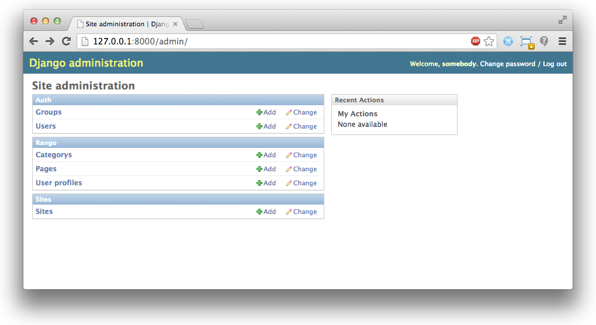
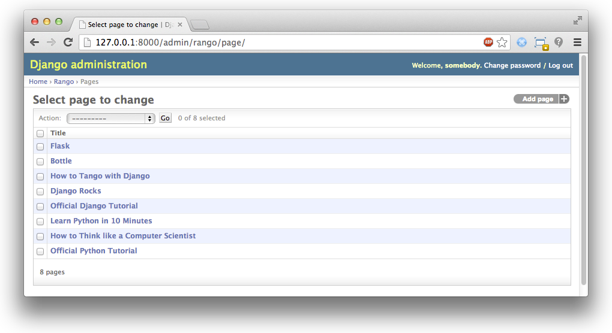
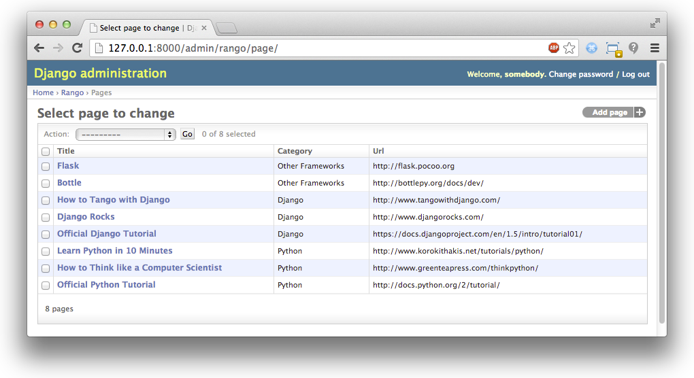

# 6 模型和数据库

通常来说处理数据库需要我们掌握许多复杂的SQL语句.但是在Django里,对象关系映射(ORM)帮我们处理这一切,包括通过模型创建数据库表.事实上,模型是描述你的数据模型/图表的一个Python对象.与以往通过SQL操作数据库不同,你只用使用Python对象就能操作数据库.在本章,我们将会学习如何设立数据库并为Rango建立模型.

## 6.1 Rango的需求

首先,让我们看看Rango的需求.下面列出了Rango数据关键的几个需求.

* Rango实际上是一个网页目录 - 一个包含其他我站链接的网站
* 有许多不同网站的目录,每个目录中包含许多链接.我们在第二章假设1对多关系.看下面的ER图.
* 一个目录要有名字,访问数和链接.
* 一个页面要有目录,标题,URL和一些视图.


## 6.2 告诉Django你的数据库

在你创造任何模型之前都要对你的数据库进行设置.在Django1.7,当你创建了一个项目,Django会自动在`settings.py`里添加一个叫做`DATABASES`的字典.它包含如下.

```
DATABASES = {
    'default': {
        'ENGINE': 'django.db.backends.sqlite3',
        'NAME': os.path.join(BASE_DIR, 'db.sqlite3'),
    }
}
```

能看到默认用SQLite3作为后端数据库.SQLite是个轻量级的数据库对我们开发很有用.我们仅仅需要设置`DATABASE_PATH`里的`NAME`键值对.其他引擎需要`USER`,`PASSWORD`,`HOST`和`PORT`等关键字.

>注意:对于教程来说使用SQLite引擎还好,但是对于部署你的应用来说可能不是最好的选择,或许应当使用其他更健壮和更大型的数据库引擎.Django同样支持像PostgreSQL和MySQL这样的流行数据库引擎.从 official Django documentation on Database Engines 获取更多细节.你可以查看关于SQLite的网站来选择是否使用SQLite引擎.

## 6.3 创建模型

让我们为Rango创建两个数据模型.

在`rango/models.py`里,我们定义两个继承自`djnago.db.models.Model`的类.这两个类分别定义目录和页面.定义`Category`和`Page`如下.

```
class Category(models.Model):
    name = models.CharField(max_length=128, unique=True)

    def __unicode__(self):  #For Python 2, use __str__ on Python 3
        return self.name

class Page(models.Model):
    category = models.ForeignKey(Category)
    title = models.CharField(max_length=128)
    url = models.URLField()
    views = models.IntegerField(default=0)

    def __unicode__(self):      #For Python 2, use __str__ on Python 3
        return self.title
```

当你定义了一个模型,你需要制定可选参数的属性以及相关的类型列表.Django提供了许多内建字段.一些常用的如下.

* `CharField`,存储字符数据的字段(例如字符串).`max_length`提供了最大长度.
* `URLField`,和`CharField`一样,但是它存储资源的URL.你也可以使用`max_length`参数.
* 'IntegerField',存储整数.
* `DateField`,存储Python的`datetime.date`.

查看Django documentation on model fields获取完整列表.

每个字段都有一个`unique`属性.如果设置为`True`,那么在整个数据库模型里它的字段里的值必须是唯一的.例如,我们上面定义的`Category`模型.`name`字段被设置为`unique` - 所以每一个目录的名字都必须是唯一的.

如果你想把这个字段作为数据库的关键字会非常有用.你可以为每个字段设置一个默认值(`default='value'`),也可以设置成`NULL`(null=True).

Django也提供了连接模型/表的简单机制.这个机制封装在3个字段里,如下.

* `ForeignKey`, 创建1对多关系的字段类型.
* `OneToOneField`,定义一个严格的1对1关系字段类型.
* `ManyToManyFeild`,当以多对多关系字段类型.

从上面我们的例子,`Page`中`category`字段是`ForeignKey`类型.所以我们可以创建一个1对多关系的`Category`模型/表,这个`Category`会作为构造函数的一个参数.Django会自动的为每个模型表中创建ID字段.所以你不同为每个模型创建主键 - 它已经为你做好了!

>注意:当创建模板的时候,最好创建`__unicode__()`方法 - 等价于`__strr__()`方法.如果你不熟悉这两个方法,它们俩的作用和Java中`toString()`方法相似.`__unicode__()`方法为模型实例提供unicode表达式.例如我们的`Category`模型通过`__unicode__()`方法返回目录的名字 - 当你开始用Django的管理界面后这将会非常便利.
在你的类里加入`__unicode__()`方法对debug也非常有用.如果在`Category`模型中没有`__unicode`方法将会返回`<Category: Category object>`.我们只知道是一个目录,但是是哪一个呢?如果我们有`__unicode__()`方法我们将会返回`<Category: python>`,这里的`python`是目录的名字.

## 6.4 创建和迁移数据库

我们定义了模型,那么Django就能很好的自动创建我们的数据库.在先前的Django版本中我们用如下命令:

```
$ python manage.py syncdb
```

而在Django1.7中提供了一个迁移工具帮助我们修改更新在模块中改变的数据库.所以现在情况变得复杂些 - 但是主要的目的是当我们改变模型的时候我们不必删除它既可进行更新.

### 6.4.1 设置数据库并创建管理员

如果还没有设置数据库那么需要通过migrate命令来设立.

```
$ python manage.py migrate


Operations to perform:
  Apply all migrations: admin, contenttypes, auth, sessions
Running migrations:
  Applying contenttypes.0001_initial... OK
  Applying auth.0001_initial... OK
  Applying admin.0001_initial... OK
  Applying sessions.0001_initial... OK
```

你是否还记得在`settings.py`文件里设置的INSTALLED_APPS列表,它会初始化创建这些app的图表,例如auth,admin等等.在你的项目根目录里会创建`db.sqlite`文件.

现在你可以创建一个管理员来管理数据库.

```
$ python manage.py createsuperuser
```

管理员账户将会在Django管理界面登陆时使用.按照提示输入用户名,邮箱地址和密码.注意要记住用户名和密码.

### 6.4.2 创建/上传模型/表

当你更改模型的时候,你需要通过`makemigrations`进行修改,所以对于rango,我们需要:

```
$ python manage.py makemigrations rango

Migrations for 'rango':
  0001_initial.py:
    - Create model Category
    - Create model Page
```

如果你检查`rango/migrations`文件,你会发现会创建一个叫做`0001_initial.py`的python脚本.如果想要SQL命令去执行迁移,那么可以用下面的命令`python manage.py sqlmigrate <app_name> <migration_no`.我们上面的迁移数字是0001,所以我们输入`python manage.py sqlmigrate rango 0001`,让我们试试看.

现在让我们应用这些迁移(基于创建数据库图表).

```
$ python manage.py migrate

Operations to perform:
  Apply all migrations: admin, rango, contenttypes, auth, sessions
Running migrations:
  Applying rango.0001_initial... OK
```

>警告:当你添加已存在的模型,你需要重复运行`python manage.py makemigrations <app_name>`命令然后再运行`python manage.py migrate`.

你可能发现了我们的`Category`模块缺少一些我们要求的字段.我们将在稍后添加.

## 6.5 Django模型和Django Shell

在我们把注意力集中到Django管理界面之前,通过Django shell创建Django模型也是值得一试的 - 它对我们debug非常有用.下面我们将展示如何用这种方式来创建`Category`实例.

为了得到shell我们需要再一次调用Django项目根目录里的`manage.py`.

```
$ python manage.py shell
```

这个实例将会创建一个Python解析器并且载入你的项目的设置.你可以和模型进行交互.下面的命令展示了这一功能.注释里可以看到每个命令的功能.

```
# Import the Category model from the Rango application
>>> from rango.models import Category

# Show all the current categories
>>> print Category.objects.all()
[] # Returns an empty list (no categories have been defined!)

# Create a new category object, and save it to the database.
>>> c = Category(name="Test")
>>> c.save()

# Now list all the category objects stored once more.
>>> print Category.objects.all()
[<Category: test>] # We now have a category called 'test' saved in the database!

# Quit the Django shell.
>>> quit()
```

在例子中我们首先导入我们需要操作的模型.然后打印出存在的目录,在这里因为我们的图表是空所以输出也是空.然后创建并储存一个目录,打印.

>注意:上面的例子只展示了Django shell一小部分功能.更多的可以看 official Django Tutorial to learn more about interacting with the model和official Django documentation on the list of available commands.

## 6.6 设置管理界面

Django最突出的一个特性就是它提供内建的网页管理界面,用来浏览和编辑存储在模型的数据,也可以与数据库图表交互.在`settings.py`文件里,注意到有一个默认安装的`django.contib.admin`app,而且你的`urls.py`里也默认增加了`admin/`匹配.

开启Django服务:

```
$ python manage.py runserver
```

访问`http://127.0.0.1:8000/admin/`.可以用先前设置管理员账户的用户名和密码来登录Django管理界面.管理界面只包含`Groups`和`Users`图表以我们需要让Django包含`rango`模块.所以打开`rango/admin.py`输入如下代码:

```
from django.contrib import admin
from rango.models import Category, Page

admin.site.register(Category)
admin.site.register(Page)
```

上面代码会为我们在管理界面注册模型.如果我们想要其他模型,可以在`admin.stie.register()`函数里传递模型作为参数.

完成之后重新访问`http://127.0.0.1:8000/admin/`,你想回看到如下图案.



点击`Categorys`链接.这里我们能看见我们通过Django shell创建的`test`目录.我们可以非常方便的在这里创建,修改和删除目录和页面.同样你可以在`Auth`应用里添加`User`来增加登陆Django管理界面的用户.

>注意:注意管理界面的排印错误(category而不是categories).这个问题可以通过在你的模型里添加元类并定义`verbose_name_plural`属性来解决.查看 Django’s official documentation on models 获取更多细节.

>注意:这里的`admin.py`文件只提供了一个简单的例子.还有许多炫酷的定制可以使用,比如说改变管理界面模型出现的方式.在本教程,我们只使用了最原始的界面.如果感兴趣请查看 official Django documentation on the admin interface .

## 6.7 创建Population Script

往数据库里输入数据会非常麻烦.许多开发者会随机的往数据库里输入测试数据.如果你在一个小的开发团队里,每个人都得传点数据.最好是写一个脚本而不是每个人单独的上传数据,这样就可以避免垃圾数据的产生.所以我们需要为你的数据库创建 population script.这个脚本自动的为你的数据库生成测试数据.

我们需要在Django项目的根目录里创建population script(例如`<workspace>/tango_with_django_project/`).创建`populate_rango.py`文件代码如下.

```
import os
os.environ.setdefault('DJANGO_SETTINGS_MODULE', 'tango_with_django_project.settings')

import django
django.setup()

from rango.models import Category, Page


def populate():
    python_cat = add_cat('Python')

    add_page(cat=python_cat,
        title="Official Python Tutorial",
        url="http://docs.python.org/2/tutorial/")

    add_page(cat=python_cat,
        title="How to Think like a Computer Scientist",
        url="http://www.greenteapress.com/thinkpython/")

    add_page(cat=python_cat,
        title="Learn Python in 10 Minutes",
        url="http://www.korokithakis.net/tutorials/python/")

    django_cat = add_cat("Django")

    add_page(cat=django_cat,
        title="Official Django Tutorial",
        url="https://docs.djangoproject.com/en/1.5/intro/tutorial01/")

    add_page(cat=django_cat,
        title="Django Rocks",
        url="http://www.djangorocks.com/")

    add_page(cat=django_cat,
        title="How to Tango with Django",
        url="http://www.tangowithdjango.com/")

    frame_cat = add_cat("Other Frameworks")

    add_page(cat=frame_cat,
        title="Bottle",
        url="http://bottlepy.org/docs/dev/")

    add_page(cat=frame_cat,
        title="Flask",
        url="http://flask.pocoo.org")

    # Print out what we have added to the user.
    for c in Category.objects.all():
        for p in Page.objects.filter(category=c):
            print "- {0} - {1}".format(str(c), str(p))

def add_page(cat, title, url, views=0):
    p = Page.objects.get_or_create(category=cat, title=title, url=url, views=views)[0]
    return p

def add_cat(name):
    c = Category.objects.get_or_create(name=name)[0]
    return c

# Start execution here!
if __name__ == '__main__':
    print "Starting Rango population script..."
    populate()
```

虽然看起来有许多代码,但是非常简单.在文件开头我们定义了许多函数,代码会在底部开始执行 - 寻找`if __name__ == '__main__'`这一行开始.我们调用了`populate()`函数.

>警告:当导入Django模块时确保已经导入了Django设置,并把环境变量`DJANGO_SETTINGS_MODULE`设置为项目设置文件.然后调用`django.setup()`来导入django设置.如果不这么做就会引发一场.这就是为什么我们需要在导入设置之后才能导入`Category`和`Page`.

`populate()`函数负责调用`add_cat()`和`add_page()`函数,而这两个函数将会创建新的目录和页面.`populate()`创建页面和目录并存到数据库.最后我们在终端里输出页面和目录.

>注意:我们使用`get_or_create()`函数创建模型实例.我们可以用`get_or_creat()`函数来检查在数据库里是否存在.如果不存在就创建它.这将减少我们的代码而不是让我们自己检查.
`get_or_create()`方法返回`(object,created)`元组.如果没有在数据库找到,那么这个`object`参数就是`get_or_create()`方法创造的实例.如果这个实体不存在,那么这个方法就返回和这个实体相符的实例.`created`是一个布尔值;如果`get_or_create()`创建模型实体的话它会返回`true`.
`[0]`会返回`object`元组的第一个位置,这个其他编程语言一样,Python使用zero-based numbering.
official Django documentation  可以查看`get_or_vreate()`方法的详细资料.

当保存退出以后,我们可以在DJango项目根目录用命令`$ python populate_rango.py`来执行脚本.

```
$ python populate_rango.py

Starting Rango population script...
- Python - Official Python Tutorial
- Python - How to Think like a Computer Scientist
- Python - Learn Python in 10 Minutes
- Django - Official Django Tutorial
- Django - Django Rocks
- Django - How to Tango with Django
- Other Frameworks - Bottle
- Other Frameworks - Flask
```

现在我们检查一下是否改变了数据库.重启Django服务,进入管理界面,查看新的目录和页面.如果点击`Pages`会看到下面.



虽然需要花费一些时间来写population script,但是在团队协作中可以分享给每个人.而且在单元测试中会有用处.

## 6.8 基本流程

现在我们已经掌握处理Django模型的核心功能,是时候总结一下了.下面将分别为你呈现.

### 6.8.1 设置数据库

当开始新Django项目,需要先告诉Django你想使用的数据库(例如设置`settings.py`中的`DATABASES`).你也可以在`admin.py`文件里注册任何模型.

### 6.8.2 加入模型

分5步进行.

1. 首先,在你的应用里的`models.py`文件里创建新的模型.
2. 修改`admin.py`注册你新加的模块.
3. 然后进行迁移`$ python manage.py sqlmigrate <app_name>`
4. 使用`$ python manage.py migrate`应用更改.这将会为你的模型在数据库里建立必要的结构.
5. 为你的新模型创建/修改population script.

总会有一些时候你不得不删除数据库.在这种情况下你需要运行`migrate`命令,然后是`createsuperuser`命令,为每个app执行`sqlmigrate`命令就可.

## 6.9 练习

现在已经完成这章,试着做下面的练习来巩固所学.

* 增加目录模型`views`和`likes`属性并设置为0.
* 为你的app/模型进行迁移.
* 更新 population script ,把Python目录设置成浏览128次和喜欢64次,Django目录浏览64次和喜欢32次,the Other Framenwork目录浏览32次,喜欢16次.
* 查看part two of official Django tutorial .它将会巩固你所学同时学习更多关于如何定制管理界面.
* 定制管理界面 - 当观看页面模型的时候它的目录,页面名和url.

### 6.9.1 提示

如果你需要一些帮助的话,下面的提示会帮助你.

* 修改`Category`模型,增加`views`和`likes`,它们的字段为`IntegerFields`.
* 修改`populate.py`脚本里的`add_cat`函数,加入`views`和`likes`参数.一旦你可以获取目录c,你就可以通过`c.views`来修改浏览次数,`likes`也一样.
* 为了定制管理界面,你需要修改`rango/admin.py`文件,创建`PageAdmin`类,这个类继承自`admin.ModelAdmin`.
* 在`PageAdmin`类里,加入`list_display = ('title', 'category', 'url')`.
* 最后注册`PageAdmin`类到Django管理界面.需要修改`admin.site.register(Page)`.在Rango的`admin.py`文件里修改成`admin.site.register(Page, PageAdmin)`.


