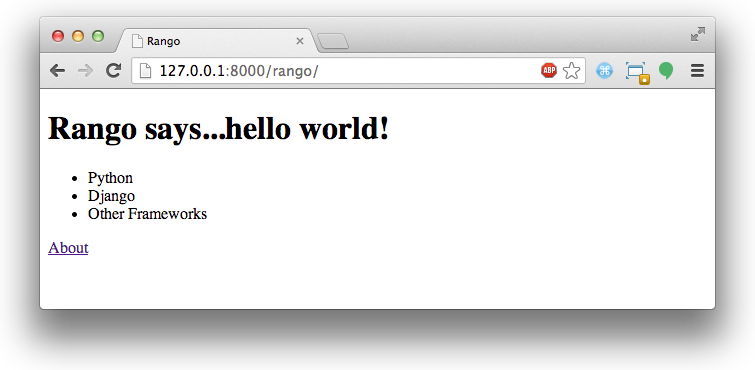
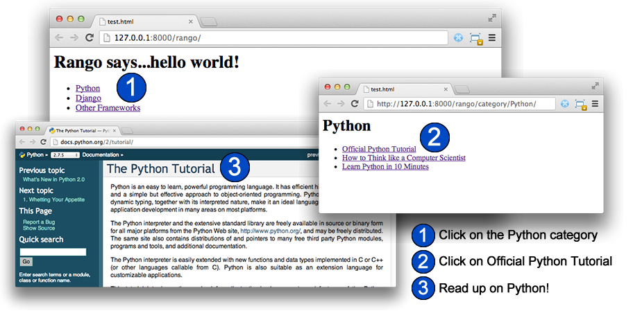

# 7 模型,模板和试图

现在我们已经建立了模型并且导入了一些数据,现在我们要把这些连一起.我们将会弄清楚如何在视图中访问数据以及如何通过模板展示数据.

## 7.1 基本流程:数据驱动页面

在Django中创建数据驱动页面必须执行以下5步.

1. 首先,在你应用的`views.py`文件中导入你要添加的模型.
2. 在视图里访问模型,导入你需要的数据.
3. 把模型的数据传递给模板.
4. 设置模板给用户呈现数据.
5. 如果还没有映射URL,映射一下吧.

上面的步骤告诉你如何使用Django里的模型,视图和模板.

## 7.2 展示Rango主页上的目录

我们需要在rango的主页显示5个最多的目录.

### 7.2.1 导入需要的模型

为了达到目的,我们需要完成上面的步骤.首先,打开`rango/view.py`并导入rango的`models.py`文件的`Category`模块.

```
# Import the Category model
from rango.models import Category
```

### 7.2.2 修改index视图

有了第一步,我们需要修改`index()`函数.让我们回想一下,这个`index()`函数负责管理主页的视图.修改如下.

```
def index(request):
    # Query the database for a list of ALL categories currently stored.
    # Order the categories by no. likes in descending order.
    # Retrieve the top 5 only - or all if less than 5.
    # Place the list in our context_dict dictionary which will be passed to the template engine.
    category_list = Category.objects.order_by('-likes')[:5]
    context_dict = {'categories': category_list}

    # Render the response and send it back!
    return render(request, 'rango/index.html', context_dict)
```

这里我们做了第二步和第三步.首先,我们访问`Category`模型得到5个最多的目录.这里用`order_by()`方法对喜欢的数量进行降序排序 - 注意带着`-`.最后我们取前5个目录保存到`category_list`

当访问数据库结束,我们把这个列表(`category_list`)传给了字典`context_dict`.这个字典同时会作为`render()`的参数返回给模板.

>警告:注意Category模型包含`likes`字段.增添它的操作在前面章节的练习里,你需要完成它们.

### 7.2.3 修改index模板

修改完视图后,最后剩下的就是更改`rango/index.html`模板了.代码如下.

```
<!DOCTYPE html>
<html>
    <head>
        <title>Rango</title>
    </head>

    <body>
        <h1>Rango says...hello world!</h1>

        
            <ul>
                
                <li>{{ category.name }}</li>
                
            </ul>
        
            <strong>There are no categories present.</strong>
        

        <a href="/rango/about/">About</a>
    </body>
</html>
```

这里我们用了Django模板语言里的`if`和`for`控制语句.在页面的`<body>`里我们检查`categories`是否为空(例如,``).

如果不为空,会建立一个无序HTML列表(在`<ul>`标签里).for循环(``)会依次在`<li>`标签里打印出每个目录的名字(`{{ category.name }}`).

如果不存在`categories`,将会输出`There are no categories present.`.

作为模板语言,所有的命令都包含在``标签里,所有的变量都在`{{`和`}}`里.

如果访问  http://127.0.0.1:8000/rango/ ,如下图所示.



## 7.3 创建详细页面

通过Rango的详细描述,我们需要列出目录的每个页面.现在我们需要克服许多困难.我们需要创建一个新的视图作为参数.我们同事需要创建URL模式和URL字符串来对应每个目录的名字.

### 7.3.1 URL设计与映射

让我们着手解决URL问题.有一种方法是为我们的目录在URL中设立唯一的ID,我们可以创建像`/rango/category/1/`或者`/rango/category/2/`,这里的数字1和2就是它们的ID.但是这样做对我们来说不太好理解.尽管我们知道数字关联着目录,但我们怎么知道1和2代表哪个目录呢?用户不试一下就不会知道.

另一种方法就是用目录名作为URL.`/rango/category/Python/`将会返回给我们关于Python的目录.这是一个简单的,可读的URL.

>注意:对于网页来说,设计一个简洁的URL是只管重要的.更多细节请看 Wikipedia’s article on Clean URLs.

### 7.3.2 为Category表增加Slug字段

为了建立简洁的url我们需要在`Category`模型里增加slug字段.首先我们需要从django导入`slugify`函数,这个函数的作用是把空格用连字符代替,例如"how do i create a slug in django"将会转换成"how-do-i-create-a-slug-in-djang".

>警告:虽然你能在URL中用空格,但是它们并不安全.更多细节查看IETF Memo on URLs.

接下来我们将会重写`Category`模型的`save`方法,我们将会调用`slugify`方法并更新`slug`字段.注意任何时候目录名称更改都会更改slug.像下面一样修改模型.

```
from django.template.defaultfilters import slugify

class Category(models.Model):
        name = models.CharField(max_length=128, unique=True)
        views = models.IntegerField(default=0)
        likes = models.IntegerField(default=0)
        slug = models.SlugField(unique=True)

        def save(self, *args, **kwargs):
                self.slug = slugify(self.name)
                super(Category, self).save(*args, **kwargs)

        def __unicode__(self):
                return self.name
```

现在需要运行下面的命令更新模型和数据库.

```
$ python manage.py makemigrations rango
$ python manage.py migrate
```

因为我们slug没有设置默认值,而且模型中已经加入进数据,所以migrate命令将会给你两个选项.选择提供默认值选项并输入默认值''.它会马上进行修改.现在重新运行population脚本.因为每个目录都会执行`save`方法,所以重写的`save`方法将会被执行修改slug字段.运行Django服务,你讲会在管理界面看到修改的数据.

**注意:这里原书会有错误,原因见http://stackoverflow.com/questions/27788456/integrityerror-column-slug-is-not-unique ,修改见      https://github.com/leifos/tango_with_django/issues/19**

在管理界面你或许希望在填写目录名的时候自动填充slug字段.按照下面的方法.

```
from django.contrib import admin
from rango.models import Category, Page

# Add in this class to customized the Admin Interface
class CategoryAdmin(admin.ModelAdmin):
    prepopulated_fields = {'slug':('name',)}

# Update the registeration to include this customised interface
admin.site.register(Category, CategoryAdmin)
admin.site.register(Page)
```

在管理界面尝试增加新的目录.看到了吧!现在我们可以加入slug字段用作我们的url.

### 7.3.3 目录页面流程

我们设计完URL以后,看看我们接下来的步骤.

1. 在`rango/views.py`导入Page模型.
2. 在`rango/views.py`中创建`category`视图 - 这个`category`视图将会增加一个`category_name_url`参数来存储目录名.
    * 我们需要一些函数来帮助我们对`category_name_url`进行编码.
3. 创建一个新模板,`templates/rango/category.html`.
4. 修改`rango/urls.py`里的`urlpatterns`映射新的`category`视图.

同样我们需要修改`index()`视图和`index.html`模板来提供到目录页面的链接.

### 7.3.4 目录视图

在`rango/views.py`中,我们需要导入`Page`模型.如下.

```
from rango.models import Page
```

下面我们将会加入我们的`category()`视图:

```
def category(request, category_name_slug):

    # Create a context dictionary which we can pass to the template rendering engine.
    context_dict = {}

    try:
        # Can we find a category name slug with the given name?
        # If we can't, the .get() method raises a DoesNotExist exception.
        # So the .get() method returns one model instance or raises an exception.
        category = Category.objects.get(slug=category_name_slug)
        context_dict['category_name'] = category.name

        # Retrieve all of the associated pages.
        # Note that filter returns >= 1 model instance.
        pages = Page.objects.filter(category=category)

        # Adds our results list to the template context under name pages.
        context_dict['pages'] = pages
        # We also add the category object from the database to the context dictionary.
        # We'll use this in the template to verify that the category exists.
        context_dict['category'] = category
    except Category.DoesNotExist:
        # We get here if we didn't find the specified category.
        # Don't do anything - the template displays the "no category" message for us.
        pass

    # Go render the response and return it to the client.
    return render(request, 'rango/category.html', context_dict)
```

和`index()`视图一样我们的新视图也要执行同样的基本步骤.我们需要定义一个字典,然后尝试从模型中导出数据,并把数据添加到字典里.我们通过参数`category_name_slug`的值来决定是哪个目录.如果在Category模型中找到目录,我们就会把`context_dict`字典传递给相关页面.

### 7.3.5 目录模板

现在为我们的新视图创建模板.在`<workspace>/tango_with_django_project/templates/rango/`目录创建`category.html`.

```
<!DOCTYPE html>
<html>
    <head>
        <title>Rango</title>
    </head>

    <body>
        <h1>{{ category_name }}</h1>
        
            
            <ul>
                
                <li><a href="{{ page.url }}">{{ page.title }}</a></li>
                
            </ul>
            
                <strong>No pages currently in category.</strong>
            
        
            The specified category {{ category_name }} does not exist!
        
    </body>
</html>
```

上面的HTML代码同样给我们展示了如何把数据通过字典传递给模板.我们用到了`category_name`变量和`category`和`pages`对象.如果`category`在模板上下文并没有定义,或者在数据库并没有发现这个目录,那么就会提示一个友好的错误信息.相反的话如果存在,我们将会检查`pages`.如果`pages`没有被定义或者不存在元素,我们同样也会呈现友好的错误提示.否则的话目录里包含的页面就会写入HTML李彪.对于在`pages`列表的每个页面我们都会展示它的`title`和`url`.

>注意:Django模板包含``标签 - 是检测对象是否在模板上下文的好方法.尝试在你的代码里使用以减少错误的发生.

### 7.3.6 参数化的URL映射

现在让我们来看看如何把`category_name_url`参数值传递给`category()`.我们需要修改rango的`urls.py`文件和`urlpatterns`元组.

```
urlpatterns = patterns('',
    url(r'^$', views.index, name='index'),
    url(r'^about/$', views.about, name='about'),
    url(r'^category/(?P<category_name_slug>[\w\-]+)/$', views.category, name='category'),)  # New!
```

你能看到当正则表达式` r'^(?P<category_name_slug>\w+)/$`匹配时会调用`view.category()`函数.我们的正则表达式会匹配URL斜杠前所有的字母数字(例如 a-z, A-Z, 或者 0-9)和连字符(-).然后把这个值作为`category_name_slug`参数传递给`views.category()`,这个参数必须在强制的`request`参数之后.

>注意:当你希望参数化URL时,一定要确保你的URL模式会正确匹配参数.为了更进一步的了解,让我们看一看上面的例子.
`url(r'^category/(?P<category_name_slug>[\w\-]+)/$', views.category, name='category')`
我们可以从这里找到在`category/`和后面的`/`之间的字符串,并把它作为参数`category_name_slug`传递给`views.category()`参数.例如,URL`category/python-books/`将会返回的`category_name_slug`参数是`python-books`.
需要知道的十,所有的视图函数必须带至少一个参数.这个参数是`request` - 它会提供HTTP请求用户的相关信息。当参数化URL时,可以给视图添加已经命名德尔参数.使用上面的例子,我们的category视图是这样的.
`def category(request, category_name_slug):`
附加参数的位置不重要,重要的是在URL模式中定义的参数名称.注意如何为我们的视图在URL模式匹配中定义`category_name_slug`参数.

>注意:正则表达式虽然开始看起来比较复杂,但是网上有许多资料. This cheat sheet将会解决你的疑问.

### 7.3.7 修改index模板

虽然我们的视图已经建立了,但是还要做的工作许多.我们的index模板需要修改并提供给用户category列表.我们可以通过slug为`index.htnl`模板中添加目录页面.

```
<!DOCTYPE html>
<html>
    <head>
        <title>Rango</title>
    </head>

    <body>
        <h1>Rango says..hello world!</h1>

        
            <ul>
                
                <!-- Following line changed to add an HTML hyperlink -->
                <li><a href="/rango/category/{{ category.slug }}">{{ category.name }}</a></li>
                
            </ul>
       
            <strong>There are no categories present.</strong>
       

    </body>
</html>
```

这里为每个列表元素(`<li>`)增加一个HTML超链接(`<a>`).超链接有一个`href`属性,我们用`{{ category.slug}}`来定义目标URL.

### 7.3.8 Demo

让我们访问rango主页.你将会看到列出所有的目录.这些目录都是可以点击的链接.点击`Python`将会带你王文`Python`目录视图,如下图所示.如果你看到了像`Official Python Tutorial`列表,说明你已经成功了建立视图.试着访问不存在的目录,比如`/rango/category/computers`,你将会看到页面不存在的信息.



## 7.4 练习

为了巩固所学请完成下面的练习吧.

* 修改index页面也包含5个最多访问的页面.
* 查看part three of official Django tutorial 

### 7.4.1 提示

修改population脚本,为每个页面增加浏览次数.
