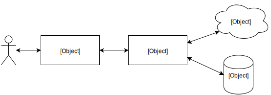
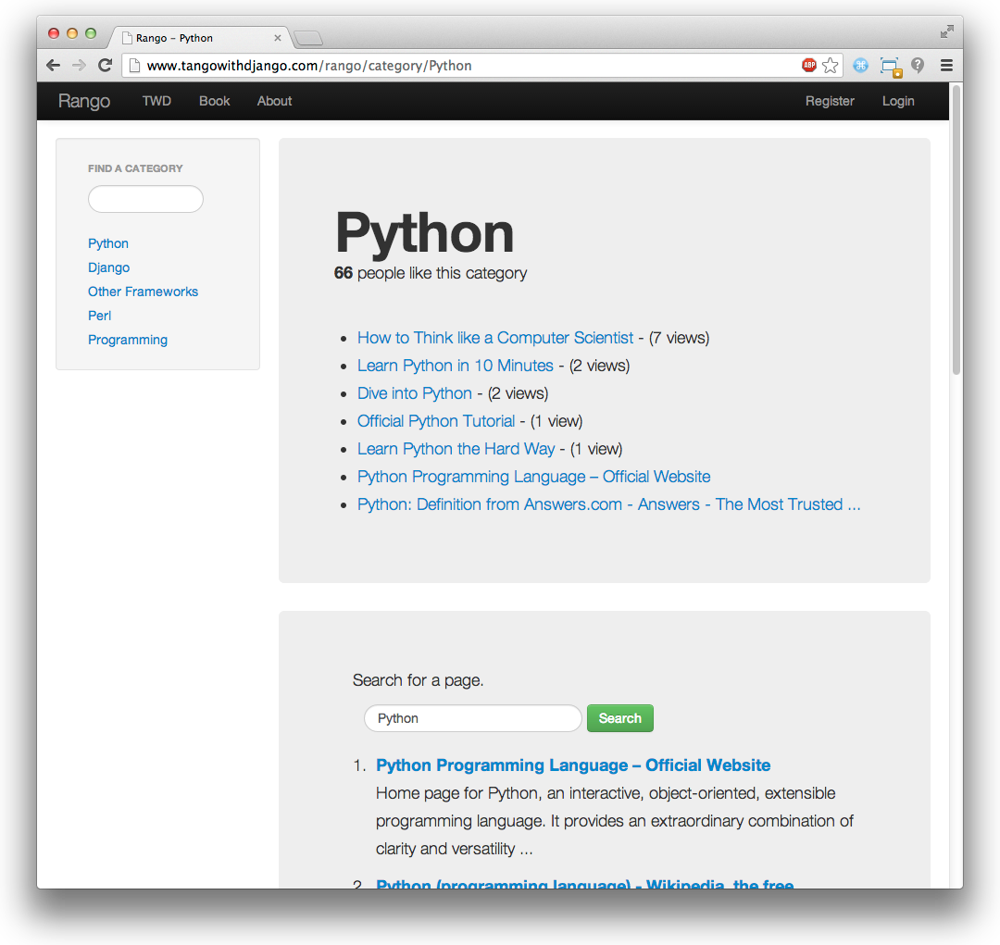

这本书的旨在通过实践教给你如何用Django1.7来开发网站.这本书主要提供给学生,包括从写出并运行你的第一个网页应用直到完成网页部署的每一步.

这本书将作为官方教程和其他出色教程的补充.通过把许多东西集合到一起,这本书填补了官方文档的许多空白,而且这本书还提供了许多关于web应用开发方面的其他内容.

## 2.1 本书特点

**这本书将节约你的时间.**许多时候我看到有些聪明的学生在学习Django和其他web开发方面遇到困难,并且花费了很多时间.这往往是因为关键的信息没有被提供或是一些事没有讲清楚.然而这些琐碎的问题将会阻碍你10-15分钟,甚至有些时候你需要花费几个小时来解决.我们尽可能的清楚了障碍.这意味着你们可以很轻松的开发你们的应用,而不用坐在那摸不着头脑.

**这本书将会降低你的学习曲线.**web应用框架可以解决你的许多麻烦并节省一大堆时间.当然,前提是你事先懂得如何去用他们!通常学习曲线非常陡峭.这本书试图让你快速学习.通过向你展示在web应用中的经验及技巧,这本书缩短了学习的曲线.

**这本书将会改善你的工作流.**用web应用框架进行开发需要你掌握并运行一个特殊的设计模式-所以你只能在特定的地方填入特定的东西.在和许多学生一起开发的时候,我们听到许多关于web应用框架的抱怨-最多的就是如何摆脱它们的控制(i.e. 反过来控制它们).为了帮助你控制他们,我们创建了一系列的工作流来清晰专注到开发流程,让你重新找到掌握web应用开发的感觉.

**这本书不是用来读的.**不管怎么样,不要读这本书!这是一个强调动手实践去开发web应用的教程.读和做是不一样的.为了增加你从这本书里的经验获得的价值,请亲自动手完成应用的开发.当你码代码的时候,千万别粘贴和复制.一个个输入,想一想它是什么,然后去读我们提供接下来会发生什么的解释.如果你仍然不明白,那么就去查看Django文档,去StackOverflow或者其他有帮助的网站,用你自己的方法去了解它.如果你觉得很有必要的话,请联系我们来改善这本书-我们已经有许多的贡献者而我们也非常高兴得到你的贡献.

## 2.2 你将会学到

在这本书里,我们将会通过一个进本的例子来逐渐学习(或者说通过提问的方式).这本书将会展示给你如何设计一个叫做Rango的web应用(参见2.4.1段落的简要设计).通过这种方式,我们将会展示给你如何完成下面的任务.

* 建立一个开发环境 - 包括如何使用终端,安装Pip,如何使用Git等等.
* 建立一个Django项目,创立一个基本的Django应用.
* 为Django项目设立静态文件和其他文件
* 使用Django的Model-View-Template设计模式
* 创建数据库模型,用Django提供的对象关系绑定功能
* 利用数据库模型生成的数据来创建动态生成页面
* 使用Django提供的用户认证服务
* 整合应用的外部服务
* 一个web应用所包括的CSS和JavaScript
* 设计和应用CSS来增加web应用的界面交互
* 使用Django的cookies和sessions
* 在应用中使用像AJAX这样的高级功能
* 用PythonAnywhere部署你的应用到web服务器

在每章的最后,我们设计了许多练习题来检验你们所学的知识.在后面的章节中提供了一些开放的开发练习并给出了代码和解释.最后,这些代码都在GitHub上:  https://github.com/leifos/tango_with_django .

要查看网站的完整版本,你可以访问 How to Tango with Django 在  http://www.tangowithdjango.com/rango/ .

## 2.3 技术和服务

通过这本书的课程,我们需要运用许多不同的技巧和外部服务,包括:

* Python, http://www.python.org
* Pip, http://www.pip-installer.org
* Django, https://www.djangoproject.com
* Git, http://git-scm.com
* GitHub, https://github.com
* HTML, http://www.w3.org/html/
* CSS, http://www.w3.org/Style/CSS/
* Javascript
* JQuery, http://jquery.com
* Twitter Bootstrap, http://getbootstrap.com/
* Bing Search API via Azure Datamarket, http://datamarket.azure.com
* PythonAnywhere, https://www.pythonanywhere.com

我们选择这些技术和服务作为web开发的基本要掌握的,它们可以提供我们把web应用集成进CSS工具或者让你的应用部署快速便捷.

## 2.4 Rango:初始设计和规划

我们先前提到过,这本书的要点是开发一个叫做Rango的应用.为了开发这个应用,它将会覆盖我们制作web应用大部分核心内容.

### 2.4.1 设计概要

你的客户端需要建立一个叫做Rango的网站,它可以让用户浏览它们自己订制的网页.在西班牙语种,rango曾经意味着"通过质量排序"或者"在社会等级中的位置"(查看  https://www.vocabulary.com/dictionary/es/rango ).

* 在网站的主页上,让浏览者看到:
    * 5个查看最多的页面
    * 5个质量最高的目录
    * 访客浏览或者查找目录的方法
* 当一个用户查看一个目录页,将会展现:
    * 目录名称,访问数量,喜欢数量;
    * 与目录相近的页面(展示页面标题和它的url);
    * 一些搜索功能(通过Bing的搜索API)用来查找一些其他能链接到这个目录的页面
* 一个特殊的目录,客户端希望目录的名字,每个目录页面被访问的次数和多少个用户点击'like'按钮被记录
* 每个目录都可以通过一个可读的URL访问 - 比如. `/rango/books-about-django/`.
* 只有注册的用户才能为目录搜索和增加页面.同时,访问者可以注册一个账户.

第一眼看上去,这个应用看起来很奇怪.事实上,它就是一个目录列表,他们可以链接到页面,对吗?然而,这里还有许多复杂的东西需要处理.首先,让我们试着画一张图来展示我们要开发什么东西.

## 2.5 练习

在继续接下来的内容之前,考虑下面的说明,试着画出设计图.

* 一个N-层或者系统架构图
* 主页和目录页的框架
* URL绑定
* 我们将要实现数据模型的实体-关系图

## 2.6 N-层结构

大多数web应用的结构是3-层结构.Rango则是这个结构的变体,它需要和一个外部服务交互.

如果我们用Django来创建web应用的话,我们每层需要如下技术.

* client是一个浏览器(i.e. Chrome, Firefox, Safari等等),它将返回 HTML/CSS页面.
* middleware是一个Django应用,它会贯穿我们开发Django内建web服务的始终.
* database将会是基于Python的SQLite3数据库引擎
* search API将会是Bing的搜索API

尽管我们需要处理上图中所有的部分,但这本书大部分的精力都集中在开发中间件(middleware).

## 2.7 线框

网站线框图为设计网站界面提供很大的帮助.它们可以节省很多时间,它不同于依赖工具的手工绘制.对于Rango,我们希望它的首页如下图所示.

目录页如下图所示:

## 2.8 页面和URL映射

通过规则说明,我们已经确认在不同的时间我们将会给用户呈现两个页面.为了进入不同的页面我们需要对URL进行映射.URL映射就是用户为了进入网页而在浏览器输入的文本.Rango的URL映射如下.

* `/rango/`将会指向主页视图.
* `/rango/about/`将会指向about页面视图.
* `/rango/category/<category_name>/`将会指向每个`<category_name>`的目录页视图,这个目录可能是:
    * 游戏;
    * python小技巧
    * 代码或者编译程序
* `/rango/etc/`,为将来的功能实现留出`etc`

当我们创建应用时,我们可能需要创建一些别的URL映射.但是上面那些使我们首先要建立的.还有要考虑到提供的目录名字不存在时,我们需要把目录名字转换为一个有效的URL字符串.

随着对这本书的深入,我们会逐渐掌握用Django框架来创建网页和用Model-View-Template设计模式.现在我们只是对URL映射和网页交互界面有个大概的印象,我们还需要定义数据模型来为我们的应用提供数据.

## 2.9 实体-关系图

通过给出的规则,我们知道至少有两个实体:目录和页面.同时一个目录可以容纳许多页面.我们可以通过以下ER图来描述我们的数据模型.

注意一点,一个页面可以在一个或多个目录里.所以我们需要建立多-对-多的关系.为了将问题不那么复杂化,我们做个简单的假设,一个目录可以包含多个页面,但是一个页面只能属于一个目录.这并不能防止了一个页面出现在两个不同目录的情况 - 在不理想的情况下,页面可能进入两次.

写技术笔记是个好的喜欢,尤其是当你知道它会再次出现的时候!通过记下它们,你可以和你的开发团队进行交流确保相同的问题可以可以很快解决.

建表如下,`Str`表示一个`string`或者`char`,`Int`表示一个`integer`,`URL`表示一个URL而`FK`表示Foreign Key.

我们同样有一个用户表 - 这里没有展示,将在以后介绍.在接下来的章节里我们可以看到在Django里如何实例化这些数据模型,并且了解如何用Django的ORM去连接数据库.

## 2.10 总结

这些设计和说明将会对我们构建我们的web应用提供很好的帮助.我们要用到的技术和步骤同样适用于大多数数据驱动的网站.熟悉这些规范和设计对我们有很大的好处.

如果你已经安装了了Python2.7和Django1.7,你对命令行设置你的路径有所了解,那么你可以直接跳过Django基础这一章.否则,让我们一起来看第三章.

### 2.10.1 和Django官方教程一起学习

我们建议Django官方教程作为这本书每个章节的练习题.你可以在下表中找到这两本书章节之间的对应关系.官方教学的练习将会帮助你深入了解Django框架,而且会提升你的技巧.

| Tango woth Django | Django Tutorial |
|:--------:|:--------:|
|Chapter 3|Part 1 - Models|
|Chapter 5|Part 2 - The Admin Interface|
|Chapter 6|Part 3 - URLs and Views|
|Chapter 7|Part 4 - Templates|
|Chapter 18|Part 5 - Testing|
|Chapter 11|Part 6 - CSS|

