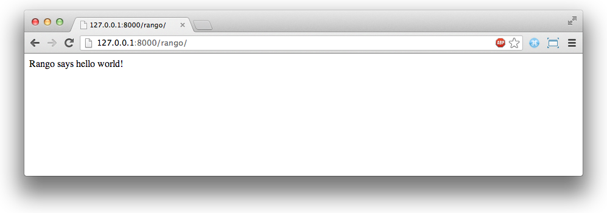

# 4 Django基础

让我们开始Django之旅吧!在本章,我们将概述如何使用Django.你可以建立一个新的项目和web应用.在本章的最后,你将能够建立一个Django页面并且运行它.

## 4.1 测试你的安装

让我们检测一下Python和Django是否是我们教程里需要的版本.

```
$ python --version
2.7.5
```

上面的命令将会运行Python解析器,如果有`-c`选项则可以执行它后面的代码.你可以查看输出以检查Python版本是否是你需要的.如果版本不是`2.7.5`,你可能需要返回3.2章节去检查一下安装时是否拉下了某些步骤.

在检验了安装的python后,让我们检验一下Django.

```
$ python -c "import django; print(django.get_version())"
1.7
```

通过调用Django模块,可以看到下方输出`1.7`.如果你得到的是其他版本,或者出现`ImportError`,那么返回3.2章节或者参看Django Documentation on Installing Django.如果你发现你的Django版本不是1.7,那么以后可能会遇到一些问题.所以还是确保Django的版本是1.7吧.

## 4.2 创建你的Django项目

在你的`code`目录里创建你的项目.

```
$ django-admin.py startproject tango_with_django_project
```

>注意:在Windows机器上你需要全路径运行django-admin.py脚本.比如`python c:\python27\scripys\django-admin.py startproject tango_with_django_project`

这个命令竟会运行`django-admin.py`脚本,它将会为你创建一个名叫`tango_with_django_project`的Django新项目.这个名字随便你取的.

你可能注意到了在你新创建的`tang_with_django_project`项目里自动创建了两个项目:

* 另一个和`tango_with_django_project`同名的目录.
* 一个叫`manage.py`的Python脚本

在这篇教程里我们把这个`tango_with_django_project`目录叫做项目设置目录,在这个目录里我们会发现有4个Python脚本.我们稍后会详细介绍下这几个脚本.

* `__init__.py`:这是一个空的脚本,用来告诉Python编译器这个目录是一个Python包.
* `settings.py`:用来存储Django项目设置的文件.
* `urls.py`:用来存储项目里的URL模式.
* `wsgi.py`:用来帮助你运行开发服务,同时可以帮助部署你的生产环境.

>注意:这个项目文件是自从1.4版本后才创立的.虽然和项目同名的目录看起来很怪,但这样做还是有道理的,它可以和其他应用进行区分.

在项目里还有一个叫做`manage.py`的文件.这个文件是我们开发项目时经常使用的文件,它为我们提供了一系列的Django命令.例如,`manage.py`允许你运行内建的Django服务来测试和运行数据库命令.真的,这个脚本是你最常用的脚本了.

>注意:可以参见Admin and Manage scripts来了解更多.

现在可以运行`manage.py`脚本了.

```
$ python manage.py runserver
```

执行上面的命令将会初始化运行一个轻量的服务器.可以在终端里看到输出如下.

```
$ python manage.py runserver

System check identified no issues (0 silenced).

You have unapplied migrations; your app may not work properly until they are applied.
Run 'python manage.py migrate' to apply them.

October 01, 2014 - 19:49:05
Django version 1.7c2, using settings 'tango_with_django_project.settings'
Starting development server at http://127.0.0.1:8000/
Quit the server with CONTROL-C.
```

```
$ python manage.py migrate

Operations to perform:
  Apply all migrations: admin, contenttypes, auth, sessions
Running migrations:
  Applying contenttypes.0001_initial... OK
  Applying auth.0001_initial... OK
  Applying admin.0001_initial... OK
  Applying sessions.0001_initial... OK

```

`migrate`命令会检查你的INSTALLED_APPS设置,同时会创建你的mysite/settings.py文件中相关的app的数据库图表(我们稍后会介绍).你将会看到所有初始化的信息.如果你感兴趣,你可以用相应数据库的命令查看Django创建的数据库,例如dt(PostgreSQL),SHOW TABLES(MySQL)或者 .schema(SQLite).

现在打开浏览器输入 http://127.0.0.1:8000/ .你将会看到下图所示.


在终端里输入`CTRL + C`就可以关掉服务器.如果你希望服务器开在别的端口,或者你希望其他主机可以访问,你可以在命令后面加入参数.

```
$ python manage.py runserver <your_machines_ip_address>:5555
```

执行上面的命令将会把服务转换到TCP的5555端口.你需要把上面的`$ python manage.py runserver <your_machines_ip_address>:5555`换成你自己主机的IP地址.

在设置端口的时候,你不能设置1024以下的端口,因为它们都是系统的预留端口.

用上面那个命令就可以轻松的向同事们展示你的网页了.当你运行你的web服务时,其他人可以通过键入`http://<your_machines_ip_address>:<port>/ `来进入你的web应用.当然这也要取决于你的网络设置.在联通之前你或许要设置以下防火墙或者代理.如果你不能远程连接你的网站,那么请检查以下你的网络.

>注意:`django-admin.py`和`manage.py`提供了许多有用的节省时间的功能.`django-admin.py`可以创建项目和应用以及一些其他的命令.不带参数的执行脚本可以参看各自的说明.official Django documentation provides a detailed list and explanation of each possible command 有详细的介绍.

如果你正在使用版本控制,那么现在可以提交你的更改到工作空间了.如果你忘记该用什么命令,可以看看crash course on GIT.

## 4.3 创建Django应用

通过一系列的设置和各种应用就可以组成一个web应用和网站,这就是Django.熟练的使用它是一个很好的软件工程实践.如果你开发了许多的小型应用,理论上讲你可以非常容易的把应用放入其他的Django项目里.不要重复造轮子!

每个Django应用的存在都对应它实现的一种功能.针对不同的功能你需要创建不同的应用.假设我们有一个项目,它包括一个投票app,一个注册app和一些内容相关的app.在其他的项目里,我们希望能重用投票和注册app,并且用他们来发送不同的内容.这里有许多应用可以下载并用到你的项目里.接下来我们将要学习如何创建你自己的应用.

一开始我们需要创建名字叫Rango的应用.在你的Django项目的目录里(例如`<workspace>/tango_with_django_project`),运行如下命令.

```
$ python manage.py startapp rango
```

这个命令在你的项目根目录里创建了一个新的名叫`rango`的目录 - 这里面包含了5个Python脚本.

* `__init__.py`,和我们前面说过的功能一样.
* `models.py`,一个存储你的应用中数据模型的地方 - 在这里描述数据的实体和关系.
* `tests.py`,存储你应用的测试代码.
* `views.py`,在这里处理用户请求和响应.
* `admin.py`,在这里你可以向Django注册你的模型,它会为你创建Django的管理界面.

`views.py`和`models.py`在每个应用中都要用到,他们俩是Django设计模式的组成部分,例如Model-View-Template模式.你可以通过the official Django documentation来了解详细的信息.

在你创建模型和视图之前,你必须要告诉Django你的新应用的存在.所以你必须修改你配置目录里的`settings.py`文件.打开文件找到`INSTALLED_APPS`元组.在元祖的最后面增加`rango`.

```
INSTALLED_APPS = (
    'django.contrib.admin',
    'django.contrib.auth',
    'django.contrib.contenttypes',
    'django.contrib.sessions',
    'django.contrib.messages',
    'django.contrib.staticfiles',
    'rango',
)
```

通过运行服务来检查你的应用是否被添加.如果运行正常,那么你的应用就成功加入.

## 4.4 创建视图

既然我们已经创建好Rango,让我们创建一个简单的视图.作为我们的第一个视图,我们就简单的把文本传送给客户端 - 我们现在不必关心模型或者模板.

用你喜欢的IDE打开位于`rango`目录里的`views.py`文件.删除注释`# Create your views here`.现在你得到一个空文件.

可以加入如下代码.

```
from django.http import HttpResponse

def index(request):
    return HttpResponse("Rango says hey there world!")

```

让我们逐行分析.

* 我们第一行首先从`django.http`模块导入HttpResponse对象.
* 在`views.py`文件里每个视图对应一个单独的函数.在这个例子中我们只创建了一个`index`视图.
* 每个视图至少带一个参数 - 一个在`django.http`模块的HttpRequest对象.
* 每个视图都要返回一个HttpResponse对象.本例中这个HttpResponse对象把一个字符串当做参数传递给客户端.

虽然已经创建了视图,但是如果想让别人看到它,你必须用URL映射这个视图.

## 4.5 URL映射

在`rango`目录里,我们需要创建一个叫做`urls.py`的文件.文件里是可以设置你的应用映射到URL(例如'http://www.tangowithdjango.com/rango/').

```
from django.conf.urls import patterns, url
from rango import views

urlpatterns = patterns('',
        url(r'^$', views.index, name='index'))
```

这段代码导入Django自带的映射URL机制.导入`rango`的`view`模块引入我们先前建立的视图.

为了建立映射,我们用到了tuple.在Django里必须用`urlpatterns`来命名这个元组.这个`urlpatterns`元组包含一些`django.conf.urls.url()`函数的调用,而每个函数里都有一个唯一的映射.在上面的代码里,我们只用了`url()`一次,所以我们只映射了一个URL.`django.conf.urls.url()`函数的第一个参数是正则表达式`^$`,指的是匹配一个空字符串.所有匹配这个模式的URL都会映射到`views.index()`这个视图.用户的请求信息会包含在`HttpRequest`对象里作为参数传递给视图.我们给`url()`函数可选参数`name`赋值为`index`.

>注意:你或许以为映射一个空URL毫无意义 - 它有什么用?当我们进行URL匹配时,只考虑到了原始URL字符串的一部分.这是因为我们的Django项目会优先处理原始URL字符串(例如`http://www.tangowithdjango.com/rango/`).一旦被处理,它将会被删除,留给剩下的部分去做匹配.在本例中,会剩下空字符串 - 所以空字符串会进行匹配!

>注意:`django.conf.urls.url()`函数的`name`参数是个可选参数.Django提供这个方法可以让你区别不同的映射.有时候连个不同的URL映射表达式会调用相同的视图.`name`可以让你轻松的区分他们 - 有些时候反响URL匹配会很有用.更多细节查看the Official Django documentation .

你或许已经看到在项目目录里已经存在了一个`urls.py`文件.为什么创建另一个呢?事实上,你可以吧所有的项目应用的URL都放在这个文件里.但是这是一个坏的习惯,这回增加你的应用的耦合.各自应用的`urls.py`文件存放各自应用的URL.为了最小耦合,你可以稍后把它们加入到项目目录的`urls.py`文件里.

这就意味着我们需要设置`tango_with_django_project`里的`urls.py`文件,把我们的Rango应用和Django连接.

我们该怎么做呢?很简单.打开项目目录里的`urls.py`文件.在你的工作目录里,有可能是`<workspace>/tango_with_django_project/tango_with_django_project/urls.py`像下面一样更新`urlpatterns`元组.

```
urlpatterns = patterns('',
    # Examples:
    # url(r'^$', 'tango_with_django_project_17.views.home', name='home'),
    # url(r'^blog/', include('blog.urls')),

    url(r'^admin/', include(admin.site.urls)),
    url(r'^rango/', include('rango.urls')), # ADD THIS NEW TUPLE!
)
```

新增的映射将会寻找匹配`^rango/`的url字符串.如果匹配成功的话将会传递给`rango.urls`(我们已经设置过了).`include()`函数是从`django.conf.urls`导入的.整个URL字符串处理过程如下图所示.在这个过程中,域名首先被提取出来然后留下其他的url字符串(`rango/`)传递给我们的tango_with_django_project,在这里它会匹配并去掉`rango/`然后把空字符串传递给rango应用.Rango现在匹配一个空字符串,它会返回我们创造的`index()`视图.


重新启动Django服务然后访问`http://127.0.0.1:8000/rango`.如果一切顺利,你将会看到`Rango says hello world!`.就像下图所示.



在每个应用中,你都可以创建许多URL映射.初始映射非常简单.下面我们会用URL做出更复杂的映射.

对于理解Django的URL机制非常的重要.如果你仍有什么困惑可以查看official Django documentation on URL,以做更进一步的了解.

>注意:URL模式使用正则表达式来进行匹配.在Python中学好正则表达式非常的有用.Python官方文档包含了userful guide on regular expressions, regexcheatsheet.com提供了 neat summary of regular expressions.

## 4.6 基本流程

本章所学的内容将会总结成一个列表.在这里我们为两个不同列表.

### 4.6.1 创建新的Django项目

1. `python django-admin.py startproject <name>`来创建项目,这里`<name>`是你希望的项目名.

### 4.6.2 创建新的Django应用

1. `$ python manage.py startapp <appname>`来创建新的应用,这里`<appname>`是你的应用名.
2. 通过把新应用名字加入到`settings.py`文件的`INSTALLED_APPS`元组里来告诉Django项目添加了新的应用.
3. 在项目的`urls.py`文件映射应用.
4. 在应用目录里创建`urls.py`文件使URL字符串指向视图.
5. 在应用的`view.py`里,创建的视图要确保返回一个`HttpResponse`对象.

## 4.7 练习

恭喜你!你已经创建并运行Rango了.这是里程碑意义的事件.创建视图和映射是迈向开发更复杂可用的web应用的第一步.现在试着练习一下巩固所学.

* 修改程序,确保你知道如何把URL映射到视图.
* 创立一个`about`视图,返回`Rango says here is the about page`.
* 把这个视图映射到`/rango/about/`.在这一步里,你只需要编辑rango应用里的`urls.py`
* 修改`index`视图的`HttpResponse`,使它返回包含about页面的链接.
* 在`about`视图里使它包含一个回到主页的链接.
* 如果你还没怎么明白,还是去看一下Django Tutorial.

### 4.7.1 提示

如果感觉练习有困难的话,下面将能帮助你完成练习.

* `index`视图里需要包含`about`视图的链接.这个很简单 - 加入`Rango says: Hello world! <br/> <a href='/rango/about'>About</a>`这样的语句就行了.接下来我们会优化这些页面的.
* 匹配`about/`的正则表达式是`r^about/`.
* 返回主页的链接是`<a href="/rango/">Index</a>`.这个结构和上面的`about`页面里的一样.
