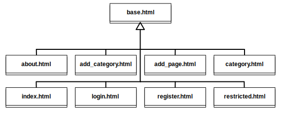

# 10 使用模板

到目前为止我们已经为我们应用里许多的不用页面创建了Django HTML模板.可能你已经注意到了在模板里有许多重复的HTML代码.

大多数网站将会有大量重复的结构(例如顶部,则边栏,底部等等),在每个模板中重复这些HTML可不是一个好的方法.在Django模板语言中使用它提供的继承功能可以减少代码大量的冗余,而不是做大量的重复复制和粘贴.

基本的模板继承步骤如下:

1. 定义应用里每个页面重复出现的部分(例如标题栏,侧边栏,底部,内容窗格)
2. 在基础模板里提供页面基本的框架和通用内容(例如在页底的版权声明,以及页面中的标识和标题),然后定义一些代码段,用户可以定义需要的代码段.
3. 创建具体的模板 - 它们都继承自基础模板 - 并且制定每个块的内容.

## 10 .1 重复的HTML和基础模板

很明显我们创建的几个模板都有很多重复的HTML代码.下面我们抽离出每个模板中都重复的部分.

```
<!DOCTYPE html>

<html>
    <head>
        <title>Rango</title>
    </head>

    <body>
        <!-- Page specific content goes here -->
    </body>
</html>
```

从现在开始让它做我们的基础模板,并且包存在`templates`目录的`base.html`文件(例如 `templates/base.html`)

>注意:应当尽可能多的抽离出重复的内容.虽然在开始的时候会有一些困难,但是一旦做完以后会省下大量的时间.想想吧:你希望看到许多同样代码的拷贝吗?

>警告:`<!DOCTYPE html>`必须放在页面的第一行!不这样做将意味着你的标记不符合W3C HTML5准则。

## 10.2 模板块

现在我们已经定义了我们的基础模板,我们可以把它变为我们需要继承的模板.我们需要在模板中加入一个模板标签以便于我们能在基础模板里重写 - 这需要用到`blocks`.

在基础模板里增加`body_block`如下.

```
<!DOCTYPE html>

<html>
    <head lang="en">
        <meta charset="UTF-8">
        <title>Rango</title>
    </head>

    <body>
        
    </body>
</html>
```

用``标签调用标准的Django模板命令.为了开启一个块,模板命令是`block <NAME>`,这里`<NAME>`是你希望创建块的名字.最后需要保证用`endblock`命令关闭块.

你也可以再块中设置'默认内容',例如:

```
This is body_block's default content.
```

当我们创建模板时我们会继承`base.html`和重写`body_block`里的内容.你也可以在模板中放置更多的块,例如,你可以分别为页面标题,底部,侧边栏设置块.Django模板系统中的块十分的有用, official Django documentation on templates查看更多内容.

### 10.2.1 更多的抽象

既然已经理解了Django块,让我们抽象出更多的基础模板.重新打开`base.html`模板修改如下.

```
<!DOCTYPE html>

<html>
    <head>
        <title>Rango - How to Tango with Django!</title>
    </head>

    <body>
        <div>
            
        </div>

        <hr />

        <div>
            <ul>
            
                <li><a href="/rango/restricted/">Restricted Page</a></li>
                <li><a href="/rango/logout/">Logout</a></li>
                <li><a href="/rango/add_category/">Add a New Category</a></li>
            
                <li><a href="/rango/register/">Register Here</a></li>
                <li><a href="/rango/login/">Login</a></li>
            

                <li><a href="/rango/about/">About</a></li>
            </ul>
        </div>
    </body>
</html>
```

我们在模板中引入两个新的特性.

* 第一个是加入新的Django模板块`title`.所以我们可以为继承自基础模板的页面定制标题.如果页面没有使用这个块,那么这个标题会默认为`Rango - How to Tango with Django!`.
* 我们也可以把`index.html`模板中的链接列表加入到`body_block`块的后部.这将会为所有继承基础模板的页面展示这些链接.可以在`body_block`内容和链接之间加入一个水平线(<hr />)以便我们区分这两部分.

注意我们的`body_block`包含在HTML`<div>`标签里 - 我们将在24章解释`<div>`意义.我们的链接同样使用`<ul>`和`<li>`标签包含在HTML无序列表里.

## 10.3 模板继承

我们已经创建了带块的基础模板,现在我们需要修改那些继承基础模板的模板.例如,让我们重构`rango/category.html`模板.

首先我们需要移除所有重复的HTML代码和模板标签/命令.然后加入代码:

```

```

`extends`命令携带一个参数,这个参数是要继承的模板(例如 rango/base.html).然后修改`category.html`模板如下.

>注意:提供给`extends`命令的参数的默认路径是项目的`templates`目录.例如,Rango所有模板应当是从`rango/base.html`扩展而不是`base.html`.

```




{{ category_name }}


    <h1>{{ category_name }}</h1>
    
        
        <ul>
                
                <li><a href="{{ page.url }}">{{ page.title }}</a></li>
                
                </ul>
        
                <strong>No pages currently in category.</strong>
                

        
                <a href="/rango/category/{{category.slug}}/add_page/">Add a Page</a>
                
        
                 The specified category {{ category_name }} does not exist!
    


```

在`category.html`模板里使用`extends`命令来继承`base.html`.在这里你不需要写一个完整的HTML文档,因为`base.html`已经提供了一个完整的框架.你只要把增添的内容写到基础模板里,它就会创建一个完整的HTML文档发送给用户浏览器.

>注意:模板非常强大,你甚至可以创建你自己的模板标签.在这里我们将演示如何减小模板里重复的HTML结构.
然而,模板可以减小应用视图里的代码.例如,如果你想在你的应用增加一些相同的数据库驱动的内容,你需要调用特定的视图来处理网页中重复的部分.这样在每个视图里就不用重复调用Django ORM函数来收集数据了.
查看更多内容请查看 Django documentation on templates.

## 10.4 模板里加入URL

到目前为止我们可以直接的在模板里键入页面/视图的URL,例如`<a href="/rango/about/"> About  </a>`.然而最好的方式是使用`url`模板标签来查找在`urls.py`文件中的url.我们需要改写一下.

```
<li><a href="">About</a></li>
```

在这里我们要指定应用和about视图.

现在可以修改基础模板的`url`模板标签:

```
<div>
        <ul>
    
        <li><a href="">Restricted Page</a></li>
        <li><a href="">Logout</a></li>
        <li><a href="">Add a New Category</a></li>
    
        <li><a href="">Register Here</a></li>
        <li><a href="">Login</a></li>
    

    <li><a href="">About</a></li>
    </ul>
</div>
```

在我们的`index.html`模板里有一个带参数的url模式,例如`category`会带一个`category.slug`参数.在这里你可以使用模板标签来传递这个`category.slug`参数,例如在模板里写入``:

```

    <li><a href="">{{ category.name }}</a></li>

```

TODO(leifos):官方提供的如何使用模板标签,http://django.readthedocs.org/en/latest/intro/tutorial03.html 这个stackoverflow也很有帮助 http://stackoverflow.com/questions/4599423/using-url-in-django-templates

TODO(leifos):指出如何把url放到一个命名空间并引用,见http://django.readthedocs.org/en/latest/intro/tutorial03.html

## 10.5 练习

完成下面的练习你将会成为Django模板专家.

* 更改所有模板使他们都继承`base.html`模板.步骤和上面的例子一样.就和下图一样,所有的模板都会继承`base.html`.当完成后记得删除`index.html`模板里的链接.我们不再需要它们了!你也可以移除在`about.html`模板里的链接.
* 在限制页面使用模板.模板取名为`restricted.html`,并且保证它也继承`base.html`模板.
* 使用url模板标签代替所有的url.
* 添加一个地址使用户不论在网站的哪个位置都能返回到主页.

>警告:记得在每个模板头部加入``以使用静态媒体.如果没有这样做,将会产生一个错误!Django模板模块需要分别单独导入 - 你不可以调用在你扩展的模板里的模块.



>注意:完成上面的练习后,所有Rango的模板都会继承`bashe`.html.让我们回过头看看`base.html`的内容,`user`对象 - 在Django请求的上下文中 - 将会用来检查当前的Rnago用户是否已经登录(通过使用`user.is_authenticated`).因为所有的Rango模板都会继承基础模板,所以所有的Rango模板的访问都要依赖于所发送请求的上下文.
因为这个新的依赖,你必须检查每个Rango的Django视图.对于每个视图,确保每个请求对于Django模板引擎都是可用的.通过这个教程,我们通过`render()`传递请求作为参数来达到这个目的.有时会发生这样的情况,如果你的请求被错误的传送可能出现用户没有登录,但是Django认为已经登录.
这里我们以`about`视图作为例子来进行检查.开始用硬编码的方式进行,代码如下.注意我们只发送字符串 - 我们没有使用`request`参数.
```
def about(request):
    return HttpResponse('Rango says: Here is the about page. <a href="/rango/">Index</a>')
```
为了使用模板我们需要调用`render`函数传递`request`对象.这将会使我们的模板引擎可以获取像`user`这样的对象,它可以允许模板引擎查看用户是否登录.(例如进行验证).
```
def about(request):
    return render(request, 'rango/about.html', {})
```
记住,`render()`最后一个参数是一个字典,它可以添加额外的数据传递给Django模板引擎.因为我们没有什么额外的数据传递给模板所以这里为空.查看5.1.3章节复习关于`render()`的知识.

